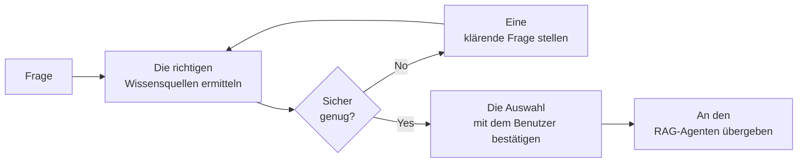

# Dokumentennavigations-Assistent

Der **Dokumentennavigations-Assistent** (der Namespace-Auswahl-Agent) ist ein **Router, der vor einem
[Dokumentenintelligenz-Assistenten](../5_document_intelligence_assistant/) sitzt**. Wenn Ihr Unternehmen viele separate
Wissenssammlungen hat – HR, Recht, Engineering, Vertrieb usw. – führt die Suche in all diesen für jede Frage zu
unübersichtlichen, gemischten Antworten. Dieser Agent ermittelt zunächst, *welchen* Sammlungen eine Frage zugeordnet
ist, bestätigt diese Auswahl mit dem Benutzer und übergibt die Frage erst dann an einen RAG-Agenten, der nur diese
Sammlungen durchsucht.

Er ruft Fragen nicht selbst ab oder beantwortet sie. Seine Aufgabe ist die **Navigation**: die richtigen Quellen
auswählen und dann delegieren.

::: tip Wann Sie diesen Agenten verwenden sollten
Verwenden Sie ihn, wenn Sie mehrere unterschiedliche Wissensbasen haben und ein einzelner RAG-Agent, der alle
durchsucht, zu einer Vermischung von nicht zusammenhängendem Material führen würde. Wenn Sie nur eine Wissensbasis haben
oder ein RAG-Agent, der alles durchsucht, gut genug funktioniert, benötigen Sie dies nicht – verwenden Sie einfach den
[Dokumentenintelligenz-Assistenten](../5_document_intelligence_assistant/) direkt.
:::

## Wissensbasen und Namespaces

Um diesen Agenten zu verstehen, benötigen Sie zwei Begriffe:

- Eine **Wissensbasis** (oder *Bucket*) ist eine Top-Level-Sammlung von Dokumenten – zum Beispiel `company_policies`.
- Ein **Namespace** ist eine benannte Unter-Sammlung innerhalb einer Wissensbasis – zum Beispiel `hr-policies`, `legal`
  oder `benefits` innerhalb von `company_policies`.

Der Dokumentennavigations-Assistent wählt **einen Namespace pro Wissensbasis** aus, der am besten zur Frage des
Benutzers passt, und übergibt diese Auswahl an den RAG-Agenten, damit dessen Suche auf genau diese Namespaces beschränkt
ist.

## Was er tut

1. **Die richtigen Quellen ermitteln.** Der Agent sucht die in den konfigurierten Wissensbasen verfügbaren Namespaces
   und verwendet ein Sprachmodell, um zu entscheiden, welche davon die Frage betrifft.
2. **Bei Unsicherheit nachfragen.** Wenn die Frage zu vage ist, um sicher zu wählen, stellt der Agent dem Benutzer eine
   klärende Frage (zum Beispiel: „Bezieht sich Ihre Frage auf Mitarbeiter- oder Kundenrichtlinien?“) und verfeinert
   seine Auswahl anhand der Antwort. Dies kann sich wiederholen, bis er sicher ist.
3. **Mit dem Benutzer bestätigen.** Vor der Suche zeigt der Agent dem Benutzer die Quellen, die er verwenden möchte, und
   bittet um Genehmigung. Wenn der Benutzer sie ablehnt, schlägt er eine andere Auswahl vor.
4. **An den RAG-Agenten übergeben.** Nach Genehmigung delegiert er die Frage an einen konfigurierten
   [Dokumentenintelligenz-Assistenten](../5_document_intelligence_assistant/), der angewiesen wird, nur die ausgewählten
   Namespaces zu durchsuchen. Die Antwort des RAG-Agenten wird direkt an den Benutzer zurückgegeben.

Die ausgewählten Quellen werden **für den Rest der Konversation gespeichert**. Nachfolgefragen im selben Chat
überspringen die Auswahl- und Genehmigungsschritte und gehen direkt an den RAG-Agenten mit denselben Quellen – sodass
der Benutzer nur einmal navigieren muss.

::: tip Schritte 2 und 3 sind Human-in-the-Loop
Die klärende Frage und der Genehmigungsschritt pausieren den Workflow und warten auf den Benutzer. Das sorgt für
präzises und transparentes Routing: Der Benutzer sieht und bestätigt immer, welche Wissensquellen durchsucht werden,
bevor eine Antwort generiert wird.
:::

## Was er *nicht* tut

- **Er ruft nicht ab oder antwortet nicht.** Das gesamte Suchen und Antworten wird vom RAG-Agenten erledigt, an den er
  delegiert. Dieser Agent entscheidet nur, *wo* gesucht werden soll, und bestätigt dies mit dem Benutzer.
- **Er benötigt einen RAG-Agenten zur Delegation.** Allein produziert er keine Antworten – ein konfiguriertes
  [Dokumentenintelligenz-Assistenten](../5_document_intelligence_assistant/)-Profil ist eine zwingende Voraussetzung
  (siehe unten).

## Typische Szenarien

- **Unternehmen mit isoliertem Wissen.** Engineering, Vertrieb, HR und Recht haben jeweils ihre eigenen Dokumente; der
  Assistent leitet jede Frage an den Namespace des richtigen Teams weiter, anstatt alle zu durchsuchen.
- **Themen-spezialisierte Plattformen.** Eine medizinische Wissensplattform mit Namespaces für `cardiology`, `neurology`
  und `oncology` fragt, welche Spezialität zutrifft, bevor sie antwortet.
- **Reduzierung von Rauschen und Kosten.** Überall dort, wo ein „alles durchsuchen“-RAG-Agent gemischte oder
  widersprüchliche Passagen zurückgibt, führt die Eingrenzung der Suche auf den richtigen Namespace zu saubereren
  Antworten und günstigerer Abfrage.

## Bevor Sie beginnen: Voraussetzungen

1. **Ein konfiguriertes RAG-Agenten-Profil.** Dies ist die wichtigste Voraussetzung. Der Dokumentennavigations-Assistent
   delegiert jede Antwort an ein [Dokumentenintelligenz-Assistenten](../5_document_intelligence_assistant/)-Profil,
   daher muss dieses Profil bereits existieren und funktionieren. Richten Sie es zuerst ein und testen Sie es.
2. **Wissensbasen, organisiert in Namespaces.** Es muss mehr als einen Namespace zur Auswahl geben, damit das Routing
   sinnvoll ist. Namespaces werden definiert, wenn Dokumente von den [Datenpipelines](../../6_pipelines/) aufgenommen
   werden.
3. **Ein Chat-Modell** für das Routing-Sprachmodell, verfügbar über die LiteLLM-Konfiguration Ihrer Plattform.

## Einrichtung

Der Agent wird als **Blueprint** geliefert, aus dem Sie konfigurierte **Profile** erstellen – siehe
[Blueprints & Profile](../2_blueprints_and_profiles/). Mit den vorhandenen Voraussetzungen:

1. **Öffnen Sie das Blueprint** unter **Admin > Agents > Blueprints** und wählen Sie
   **Dokumentennavigations-Assistent**.
2. **Erstellen Sie ein Profil** mit einer **Agenten-ID**, einem **Namen**, einer **Beschreibung** und einem **Icon**.
3. **Wählen Sie das Chat-Modell** aus, das verwendet wird, um herauszufinden, welchen Quellen eine Frage zugeordnet ist.
4. **Wählen Sie die Wissensdatenbanken** aus, zwischen denen der Assistent routen darf. Deren Namespaces werden zu den
   Optionen, aus denen er wählt.
5. **Wählen Sie den RAG-Agenten zur Delegation aus.** Wählen Sie das Dokumentenintelligenz-Assistenten-Profil aus, das
   die eigentliche Suche und Beantwortung durchführt. Der Auswahl-Dialog listet Agenten auf, die RAG-ähnliche Anfragen
   akzeptieren.
6. **Passen Sie optional** die Genehmigungsnachricht an, die den Benutzern angezeigt wird, und wie viel
   Konversationsverlauf der Router speichert.
7. **Speichern und testen.** Stellen Sie Fragen, die in verschiedenen Namespaces landen sollten, und bestätigen Sie,
   dass das Routing und die Genehmigung wie erwartet funktionieren.

## Konfigurationsreferenz

### Profilidentität

| Feld             | Typ                | Erforderlich | Beschreibung                                                                           |
| :--------------- | :----------------- | :----------- | :------------------------------------------------------------------------------------- |
| **Agenten-ID**   | Text               | Ja           | Eindeutige, URL-sichere Kennung. Kleinbuchstaben, Ziffern, Unterstriche, Bindestriche. |
| **Name**         | Text (pro Sprache) | Ja           | Anzeigename für Benutzer.                                                              |
| **Beschreibung** | Text (pro Sprache) | Ja           | Kurze Erklärung, die im Assistenten-Auswahl-Dialog angezeigt wird.                     |
| **Icon**         | Icon-Auswahl       | Nein         | Visuelle Kennung.                                                                      |

### Routing

Diese Einstellungen steuern, wie der Assistent entscheidet, wo gesucht werden soll und wohin er die Frage sendet.

| Feld                   | Typ                  | Standard | Erforderlich | Beschreibung                                                                                                                                                                                         |
| :--------------------- | :------------------- | :------- | :----------- | :--------------------------------------------------------------------------------------------------------------------------------------------------------------------------------------------------- |
| **Modell**             | Modell-Auswahl       | —        | Ja           | Das Chat-Modell, das verwendet wird, um herauszufinden, welchen Namespaces eine Frage zugeordnet ist.                                                                                                |
| **Wissensdatenbanken** | Wissensbasis-Auswahl | —        | Ja           | Die Wissensbasen, zwischen denen der Assistent routen darf. Deren Namespaces sind die Optionen, aus denen er wählt. Mindestens eine.                                                                 |
| **RAG-Agent**          | Agenten-Auswahl      | —        | Ja           | Das [Dokumentenintelligenz-Assistenten](../5_document_intelligence_assistant/)-Profil, an das Fragen delegiert werden. Der Auswahl-Dialog listet Agenten auf, die RAG-ähnliche Anfragen akzeptieren. |

Der **Modell**-Auswahl-Dialog bietet auch die Standard-Parameter des Sprachmodells (Temperatur, Timeout und die
Log-Wahrscheinlichkeitsoptionen), die auf der Seite
[Dokumentenintelligenz-Assistent](../5_document_intelligence_assistant/#language-model) beschrieben sind; eine niedrige
Temperatur ist am besten, da das Routing konsistent sein sollte.

### Konversationsverhalten

| Feld                              | Typ         | Standard                | Beschreibung                                                                                                                                                                                               |
| :-------------------------------- | :---------- | :---------------------- | :--------------------------------------------------------------------------------------------------------------------------------------------------------------------------------------------------------- |
| **Maximale Verlaufsrunden**       | Zahl        | `20`                    | Wie viele der jüngsten Konversationsrunden der Router beibehält, während er die richtigen Quellen ermittelt. Die ursprüngliche Frage wird immer beibehalten. Minimum 4, Maximum 100.                       |
| **Vorlage Genehmigungsnachricht** | Langer Text | *(Standard vorgegeben)* | Die Nachricht, die angezeigt wird, wenn der Benutzer aufgefordert wird, die ausgewählten Quellen zu genehmigen. Verwenden Sie den `{namespaces}`-Platzhalter, wo die vorgeschlagene Liste erscheinen soll. |

## Bewährte Praktiken

**Bauen und testen Sie den RAG-Agenten zuerst.** Dieser Assistent ist nur so gut wie der
Dokumentenintelligenz-Assistent, an den er delegiert. Bringen Sie diesen zuerst zum Laufen, bevor Sie einen Navigator
davor setzen.

**Geben Sie Namespaces klare, beschreibende Namen.** Das Routing-Modell entscheidet basierend auf Namespace-Namen und
-Beschreibungen – `hr-policies` und `customer-contracts` routen weitaus zuverlässiger als `docs1` und `docs2`.

**Halten Sie die Temperatur des Routing-Modells niedrig.** Routing ist eine Klassifizierungsaufgabe; Konsistenz ist
wichtiger als Kreativität.

**Verwenden Sie ihn nur, wenn Sie tatsächlich mehrere Wissensbasen haben.** Für eine einzelne Wissensbasis fügt er einen
Genehmigungsschritt ohne Nutzen hinzu – verwenden Sie stattdessen den
[Dokumentenintelligenz-Assistenten](../5_document_intelligence_assistant/) direkt.

**Passen Sie die Genehmigungsnachricht an Ihre Benutzer an.** Die Standardeinstellung fragt generisch nach Bestätigung;
eine Nachricht, die auf Ihr Publikum zugeschnitten ist, lässt den Navigationsschritt natürlicher und weniger technisch
wirken.
