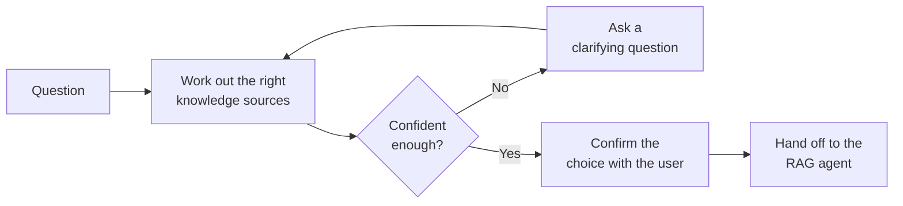

# Document Navigation Assistant

The **Document Navigation Assistant** (the namespace-selection agent) is a **router that sits in front of a
[Document Intelligence Assistant](../5_document_intelligence_assistant/)**. When your organization has many separate
knowledge collections — HR, Legal, Engineering, Sales, and so on — searching all of them for every question produces
noisy, mixed answers. This agent first works out *which* collections a question belongs to, confirms that choice with
the user, and only then hands the question off to a RAG agent that searches just those collections.

It does not retrieve or answer questions itself. Its job is **navigation**: pick the right sources, then delegate.

::: tip When to reach for this agent
Use it when you have several distinct knowledge bases and a single RAG agent searching all of them would mix unrelated
material. If you only have one knowledge base, or a RAG agent searching everything works well enough, you don't need
this — just use the [Document Intelligence Assistant](../5_document_intelligence_assistant/) directly.
:::

## Knowledge bases and namespaces

To understand this agent you need two terms:

- A **knowledge base** (or *bucket*) is a top-level collection of documents — for example `company_policies`.
- A **namespace** is a labelled sub-collection within a knowledge base — for example `hr-policies`, `legal`, or
  `benefits` inside `company_policies`.

The Document Navigation Assistant chooses **one namespace per knowledge base** that best matches the user's question,
and passes that selection to the RAG agent so its search is restricted to exactly those namespaces.

## What it does

1. **Work out the right sources.** The agent looks up the namespaces available in the configured knowledge bases and
   uses a language model to decide which ones the question is about.
2. **Ask if unsure.** If the question is too vague to choose confidently, the agent asks the user a clarifying question
   (for example, "Are you asking about employee or customer policies?") and refines its choice from the answer. This can
   repeat until it is confident.
3. **Confirm with the user.** Before searching, the agent shows the user the sources it intends to use and asks for
   approval. If the user rejects them, it proposes a different selection.
4. **Hand off to the RAG agent.** Once approved, it delegates the question to a configured
   [Document Intelligence Assistant](../5_document_intelligence_assistant/), telling it to search only the chosen
   namespaces. The RAG agent's answer is passed straight back to the user.

The chosen sources are **remembered for the rest of the conversation**. Follow-up questions in the same chat skip the
selection and approval steps and go straight to the RAG agent with the same sources — so the user only navigates once.

::: tip Steps 2 and 3 are human-in-the-loop
The clarifying question and the approval step pause the workflow and wait for the user. This is what keeps routing
accurate and transparent: the user always sees and confirms which knowledge sources will be searched before any answer
is generated.
:::

## What it does *not* do

- **It doesn't retrieve or answer.** All searching and answering is done by the RAG agent it delegates to. This agent
  only decides *where* to look and confirms it with the user.
- **It needs a RAG agent to delegate to.** On its own it produces no answers — a configured
  [Document Intelligence Assistant](../5_document_intelligence_assistant/) profile is a hard requirement (see below).

## Typical scenarios

- **Enterprise with siloed knowledge.** Engineering, Sales, HR, and Legal each have their own documents; the assistant
  routes each question to the right team's namespace instead of searching all of them.
- **Topic-specialized platforms.** A medical knowledge platform with `cardiology`, `neurology`, and `oncology`
  namespaces asks which specialty applies before answering.
- **Reducing noise and cost.** Anywhere a "search everything" RAG agent returns mixed or contradictory passages,
  narrowing the search to the right namespace produces cleaner answers and cheaper retrieval.

## Before you start: prerequisites

1. **A configured RAG agent profile.** This is the single most important prerequisite. The Document Navigation Assistant
   delegates every answer to a [Document Intelligence Assistant](../5_document_intelligence_assistant/) profile, so that
   profile must already exist and work. Set it up and test it first.
2. **Knowledge bases organized into namespaces.** There must be more than one namespace to choose between for routing to
   be meaningful. Namespaces are defined when documents are ingested by the [data pipelines](../../6_pipelines/).
3. **A chat model** for the routing language model, available through your platform's LiteLLM configuration.

## Setting it up

The agent is delivered as a **blueprint** from which you create configured **profiles** — see
[Blueprints & Profiles](../2_blueprints_and_profiles/). With the prerequisites in place:

1. **Open the blueprint** under **Admin > Agents > Blueprints** and select **Document Navigation Assistant**.
2. **Create a profile** with an **Agent ID**, **Name**, **Description**, and **Icon**.
3. **Choose the chat model** used to work out which sources a question belongs to.
4. **Select the knowledge databases** the assistant is allowed to route between. Their namespaces become the choices it
   picks from.
5. **Select the RAG agent to delegate to.** Pick the Document Intelligence Assistant profile that will do the actual
   searching and answering.
6. **Optionally customize** the approval message shown to users and how much conversation history the router keeps.
7. **Save and test.** Ask questions that should land in different namespaces and confirm the routing and approval behave
   as expected.

## Configuration reference

### Profile identity

| Field           | Type                | Required | Description                                                                   |
| --------------- | ------------------- | -------- | ----------------------------------------------------------------------------- |
| **Agent ID**    | Text                | Yes      | Unique, URL-safe identifier. Lowercase letters, digits, underscores, hyphens. |
| **Name**        | Text (per language) | Yes      | Display name shown to users.                                                  |
| **Description** | Text (per language) | Yes      | Short explanation shown in the assistant picker.                              |
| **Icon**        | Icon picker         | No       | Visual identifier.                                                            |

### Routing

These settings control how the assistant decides where to search and where it sends the question.

| Field                   | Type                  | Default | Required | Description                                                                                                                                                                   |
| ----------------------- | --------------------- | ------- | -------- | ----------------------------------------------------------------------------------------------------------------------------------------------------------------------------- |
| **Model**               | Model picker          | —       | Yes      | The chat model used to work out which namespaces a question belongs to.                                                                                                       |
| **Knowledge Databases** | Knowledge-base picker | —       | Yes      | The knowledge bases the assistant may route between. Their namespaces are the options it chooses from. At least one.                                                          |
| **RAG Agent**           | Agent picker          | —       | Yes      | The [Document Intelligence Assistant](../5_document_intelligence_assistant/) profile that questions are delegated to. The picker lists agents that accept RAG-style requests. |

The **Model** picker also exposes the standard language-model parameters (temperature, timeout, and the log-probability
options) described on the [Document Intelligence Assistant](../5_document_intelligence_assistant/#language-model) page;
a low temperature is best, since routing should be consistent.

### Conversation behaviour

| Field                         | Type      | Default              | Description                                                                                                                                            |
| ----------------------------- | --------- | -------------------- | ------------------------------------------------------------------------------------------------------------------------------------------------------ |
| **Max history entries**       | Number    | `20`                 | How many recent conversation turns the router keeps while working out the right sources. The original question is always kept. Minimum 4, maximum 100. |
| **Approval message template** | Long text | *(default provided)* | The message shown when asking the user to approve the chosen sources. Use the `{namespaces}` placeholder where the proposed list should appear.        |

## Best practices

**Build and test the RAG agent first.** This assistant is only as good as the Document Intelligence Assistant it
delegates to. Get that working on its own before putting a navigator in front of it.

**Give namespaces clear, descriptive names.** The routing model decides based on namespace names and descriptions —
`hr-policies` and `customer-contracts` route far more reliably than `docs1` and `docs2`.

**Keep the routing model's temperature low.** Routing is a classification task; consistency matters more than
creativity.

**Use it only when you genuinely have multiple knowledge bases.** For a single knowledge base it adds an approval step
with no benefit — use the [Document Intelligence Assistant](../5_document_intelligence_assistant/) directly instead.

**Tune the approval message for your users.** The default asks for confirmation generically; a message phrased for your
audience makes the navigation step feel natural rather than technical.
