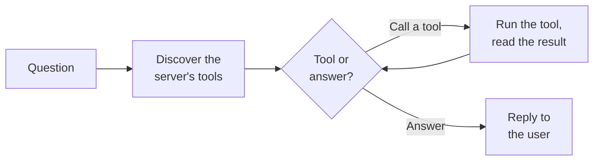

# MCP Tool Agent

Der **MCP Tool Agent** (der MCP ReAct Agent) ist der Agent, der *Aktionen ausführt*, anstatt nur Fragen zu beantworten.
Er verbindet sich mit einem externen **MCP-Server** – einer Standardmethode zur Bereitstellung von Tools für KI –,
entdeckt die Tools, die dieser Server anbietet, und überlegt dann Schritt für Schritt, welche Tools aufgerufen werden
müssen, um die Anfrage des Benutzers zu erfüllen: ein Ticket erstellen, einen Datensatz nachschlagen, eine Nachricht
senden, eine interne API abfragen und so weiter.

Wo die anderen Agents aus Dokumenten lesen oder an Menschen weiterleiten, **führt dieser Agent Aktionen in anderen
Systemen aus**. Er arbeitet in einer Schleife – denken, handeln, beobachten, erneut denken – bekannt als **ReAct**
(Reason + Act), und fährt fort, bis er die benötigten Informationen zur Beantwortung hat oder eine Sicherheitsgrenze
erreicht ist.

::: tip Was ist MCP?
Das **Model Context Protocol (MCP)** ist ein offener Standard, um Tools und Daten für KI-Agents bereitzustellen. Anstatt
für jedes System eine kundenspezifische Integration zu erstellen, verweisen Sie den Agent auf einen MCP-Server, und er
entdeckt automatisch, was dieser Server leisten kann. Siehe die
[Agents-Übersicht](/de/docs/agents/#connecting-to-external-tools) für die Sichtweise der Plattform auf die Verbindung
von Agents mit externen Tools.
:::

## Was es leistet

1. **Tools entdecken.** Der Agent verbindet sich mit dem konfigurierten MCP-Server, listet die von ihm angebotenen Tools
   (und alle Datenressourcen) auf und bereitet die Konversation vor – einschliesslich aller Anweisungen, die der Server
   selbst bereitstellt.
2. **Entscheiden, was zu tun ist.** Das Sprachmodell betrachtet die Anfrage und die verfügbaren Tools und entscheidet:
   ein Tool aufrufen oder dem Benutzer direkt antworten?
3. **Tool ausführen und beobachten.** Wenn es ein Tool ausgewählt hat, ruft der Agent es auf dem MCP-Server auf, liest
   das Ergebnis und speist dieses zurück in die Konversation.
4. **Wiederholen.** Mit den neuen Informationen entscheidet das Modell erneut – ein weiteres Tool aufrufen oder
   antworten. Diese Denk-Handel-Beobachtungs-Schleife wird bei Bedarf fortgesetzt.
5. **Antworten oder stoppen.** Wenn das Modell bereit ist, antwortet es dem Benutzer. Wenn es zu oft ohne Abschluss in
   einer Schleife läuft, stoppt es elegant bei einer konfigurierten Iterationsgrenze.

## Was es *nicht* leistet

- **Keine Wissensdatenbank / RAG.** Es durchsucht Ihre Dokumente nicht. Für fundierte Dokumentantworten verwenden Sie
  den [Document Intelligence Assistant](/de/docs/agents/5_document_intelligence_assistant/).
- **Keine Eskalation an Menschen.** Es übergibt nicht an einen Kollegen – seine „Hände“ sind die Tools auf dem
  MCP-Server.
- **Es ist nur so leistungsfähig wie der Server, mit dem es sich verbindet.** Die Tools, ihr Verhalten und ihre
  Berechtigungen befinden sich alle auf dem MCP-Server, nicht in diesem Agent. Der Agent entdeckt und orchestriert sie;
  er definiert sie nicht.

## Typische Szenarien

- **Ticketaktionen.** Verbunden mit dem MCP-Server eines Ticketsystems, kann es Tickets als Reaktion auf eine
  Benutzeranfrage erstellen, nachschlagen und aktualisieren.
- **Datensatzabfragen.** Fragen Sie ein CRM oder eine interne Datenbank ab, die über MCP verfügbar gemacht wurde, und
  fassen Sie zusammen, was es findet.
- **Systemübergreifende Aufgaben.** Verketten Sie mehrere Tool-Aufrufe – einen Datensatz finden, dann darauf reagieren –
  innerhalb einer einzigen Anfrage.
- **Senden von Nachrichten oder Benachrichtigungen** über ein System, das diese Aktionen als MCP-Tools bereitstellt.

## Bevor Sie beginnen: Voraussetzungen

1. **Ein erreichbarer MCP-Server.** Dies ist die zentrale Abhängigkeit. Ein MCP-Server muss bereits laufen und von der
   Plattform aus erreichbar sein, um die Tools bereitzustellen, die der Agent verwenden soll. Der Agent stellt selbst
   keine Tools bereit – er verbindet sich mit einem Server, der dies tut.
2. **Die URL des Servers** und, falls der Server dies erfordert, **Anmeldeinformationen** (ein statischer API-Schlüssel
   oder eine Authentifizierung pro Benutzer – siehe die untenstehenden Authentifizierungsmodi).
3. **Ein Chat-Modell**, das zur Tool-Nutzung fähig ist und über Ihre LiteLLM-Konfiguration verfügbar ist. Die Qualität
   der Tool-Aufrufe hängt stark vom Modell ab, daher ist ein leistungsfähiges Modell vorzuziehen.

::: warning Aktionen sind real
Im Gegensatz zu den Nur-Lese-Agents kann dieser Agent Dinge in anderen Systemen ändern. Stellen Sie sicher, dass der
MCP-Server nur Tools bereitstellt, die Sie dem Agenten bedenkenlos zur Verfügung stellen möchten, und passen Sie dessen
Anmeldeinformationen entsprechend an.
:::

## Einrichtung

Der Agent wird als **Blueprint** geliefert, aus dem Sie konfigurierte **Profile** erstellen – siehe
[Blueprints & Profile](/de/docs/agents/2_blueprints_and_profiles/). Mit den vorhandenen Voraussetzungen:

1. **Öffnen Sie den Blueprint** unter **Admin > Agents > Blueprints** und wählen Sie **MCP Tool Agent**.
2. **Erstellen Sie ein Profil** mit einer **Agent ID**, einem **Namen**, einer **Beschreibung** und einem **Icon**.
3. **Konfigurieren Sie die MCP-Verbindung.** Geben Sie einen Namen, die Server-URL an und wählen Sie die
   Authentifizierungsmethode (siehe Authentifizierungsmodi unten).
4. **Wählen Sie das Chat-Modell.** Wählen Sie ein leistungsfähiges, Tool-aufrufendes Modell und halten Sie die
   Temperatur niedrig.
5. **Schreiben Sie einen System-Prompt**, der die Rolle des Agenten und alle Regeln für die Verwendung der Tools
   beschreibt.
6. **Legen Sie die Iterationsgrenze fest**, um zu begrenzen, wie viele Denk-Handel-Schleifen der Agent ausführen darf.
7. **Speichern und testen Sie** mit einer Anfrage, die einen Tool-Aufruf auslösen sollte, und bestätigen Sie, dass das
   Tool ausgeführt wird und das Ergebnis zurückkommt.

## Konfigurationsreferenz

### Profilidentität

| Feld             | Typ                | Erforderlich | Beschreibung                                                                                |
| :--------------- | :----------------- | :----------- | :------------------------------------------------------------------------------------------ |
| **Agent ID**     | Text               | Ja           | Eindeutiger, URL-sicherer Bezeichner. Kleinbuchstaben, Ziffern, Unterstriche, Bindestriche. |
| **Name**         | Text (pro Sprache) | Ja           | Anzeigename.                                                                                |
| **Beschreibung** | Text (pro Sprache) | Ja           | Kurze Erklärung, was dieses Profil leistet.                                                 |
| **Icon**         | Icon-Auswahl       | Nein         | Visueller Bezeichner. Standardmässig ein Stecker-Icon.                                      |

### MCP-Server-Verbindung

Wie der Agent den externen Tool-Server erreicht.

| Feld              | Typ             | Standard  | Beschreibung                                                                         |
| :---------------- | :-------------- | :-------- | :----------------------------------------------------------------------------------- |
| **Name**          | Text            | —         | Ein logischer Name für diese Verbindung. Erforderlich.                               |
| **URL**           | Text            | —         | Die URL des MCP-Servers. Der Transport wird automatisch abgeleitet. Erforderlich.    |
| **Auth-Modus**    | Auswahl         | `api_key` | Wie authentifiziert werden soll (siehe unten).                                       |
| **API-Schlüssel** | Passwort        | *(leer)*  | Der statische Schlüssel, nur sichtbar, wenn **Auth-Modus** *API key* ist.            |
| **Timeout**       | Zahl (Sekunden) | `30`      | Wie lange auf den Server gewartet werden soll, bevor aufgegeben wird. Bereich 1–300. |

**Authentifizierungsmodi:**

| Modus              | Was es tut                                                              | Wann zu verwenden                                                                                                                                                                            |
| :----------------- | :---------------------------------------------------------------------- | :------------------------------------------------------------------------------------------------------------------------------------------------------------------------------------------- |
| **Keine**          | Keine Anmeldeinformationen gesendet.                                    | Offene oder netzwerkvertrauenswürdige Server.                                                                                                                                                |
| **API-Schlüssel**  | Sendet einen einzigen statischen Schlüssel für alle Anfragen.           | Der Agent agiert als ein gemeinsames Dienstkonto.                                                                                                                                            |
| **Benutzer-Token** | Leitet das eigene Token des anfragenden Benutzers an den Server weiter. | Wenn Aktionen dem einzelnen Benutzer zugeschrieben – und pro Benutzer zugelassen – werden sollen, damit der Audit-Trail und die Benutzerberechtigungen des externen Systems korrekt bleiben. |

### Logik

| Feld                    | Typ            | Standard | Beschreibung                                                                                                                                 |
| :---------------------- | :------------- | :------- | :------------------------------------------------------------------------------------------------------------------------------------------- |
| **Modell**              | Modell-Auswahl | —        | Das Chat-Modell, das argumentiert und Tools auswählt. Bevorzugen Sie ein starkes Tool-Calling-Modell. Erforderlich.                          |
| **System-Prompt**       | Langer Text    | *(leer)* | Anweisungen, wie sich der Agent verhalten und die Tools verwenden soll.                                                                      |
| **Max. Iterationen**    | Zahl           | `10`     | Wie viele Denk-Handel-Schleifen der Agent ausführen darf, bevor er elegant stoppt. Bereich 1–100. Begrenzt die unkontrollierte Tool-Nutzung. |
| **Max. Eingabe-Tokens** | Zahl           | `128000` | Das Eingabebudget; die Konversation wird entsprechend gekürzt. Bereich 1.000–200.000.                                                        |

Das **Modell** stellt auch die Standardparameter (Temperatur, Timeout, Log-Wahrscheinlichkeitsoptionen) bereit, die auf
der Seite [Document Intelligence Assistant](/de/docs/agents/5_document_intelligence_assistant/#language-model)
beschrieben sind.

## Best Practices

**Beschränken Sie den Server, nicht nur den Agent.** Die stärkste Sicherheitskontrolle ist das, was der MCP-Server
bereitstellt. Geben Sie ihm nur die Tools, die Sie verfügbar machen möchten, und passen Sie seine Anmeldeinformationen
auf das Nötigste an.

**Bevorzugen Sie die Benutzer-Token-Authentifizierung, wenn Aktionen persönlich sind.** Wenn der Agent im Namen eines
Benutzers in einem anderen System handelt, sorgt die *Benutzer-Token*-Authentifizierung dafür, dass die Berechtigungen
und der Audit-Trail dieses Systems korrekt bleiben, anstatt dass alles als ein einziges gemeinsames Konto erscheint.

**Legen Sie eine sinnvolle Iterationsgrenze fest.** Der Standardwert von 10 ist für die meisten Aufgaben ausreichend.
Senken Sie ihn für einfache Ein-Tool-Aktionen; erhöhen Sie ihn vorsichtig für mehrstufige Workflows. Die Grenze ist Ihre
Leitplanke gegen unendliche Schleifen des Agenten.

**Verwenden Sie ein leistungsfähiges, Tool-aufrufendes Modell bei niedriger Temperatur.** Eine zuverlässige Tool-Auswahl
hängt vom Modell ab. Ein starkes Modell bei niedriger Temperatur wählt das richtige Tool mit den richtigen Argumenten
weitaus konsistenter aus.

**Seien Sie im System-Prompt explizit.** Sagen Sie dem Agenten, wofür er ist, welche Tools er bevorzugen soll und was er
nicht tun darf. Klare Anweisungen reduzieren falsche oder unnötige Tool-Aufrufe.
