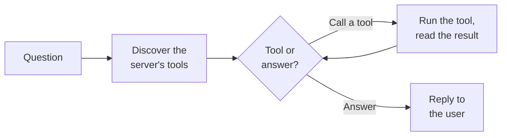

# MCP Tool Agent

The **MCP Tool Agent** (the MCP ReAct agent) is the one agent that *does things* rather than just answering questions.
It connects to an external **MCP server** — a standard way of exposing tools to AI — discovers the tools that server
offers, and then reasons step by step about which tools to call to fulfil the user's request: create a ticket, look up a
record, send a message, query an internal API, and so on.

Where the other agents read from documents or relay to humans, this agent **takes actions in other systems**. It works
in a loop — think, act, observe, think again — known as **ReAct** (Reason + Act), continuing until it has what it needs
to answer or until it reaches a safety limit.

::: tip What is MCP?
The **Model Context Protocol (MCP)** is an open standard for exposing tools and data to AI agents. Instead of building a
custom integration for every system, you point the agent at an MCP server and it automatically discovers what that
server can do. See the [Agents overview](../#connecting-to-external-tools) for the platform's take on connecting agents
to external tools.
:::

## What it does

1. **Discover the tools.** The agent connects to the configured MCP server, lists the tools (and any data resources) it
   offers, and prepares the conversation — including any instructions the server itself provides.
2. **Decide what to do.** The language model looks at the request and the available tools and decides: call a tool, or
   answer the user directly?
3. **Run the tool and observe.** If it chose a tool, the agent calls it on the MCP server, reads the result, and feeds
   that back into the conversation.
4. **Repeat.** With the new information, the model decides again — call another tool or answer. This reason-act-observe
   loop continues as needed.
5. **Answer or stop.** When the model is ready, it replies to the user. If it loops too many times without finishing, it
   stops gracefully at a configured iteration limit.

## What it does *not* do

- **No knowledge base / RAG.** It doesn't search your documents. For grounded document answers, use the
  [Document Intelligence Assistant](../5_document_intelligence_assistant/).
- **No human escalation.** It doesn't hand off to a colleague — its "hands" are the tools on the MCP server.
- **It's only as capable as the server it connects to.** The tools, their behaviour, and their permissions all live on
  the MCP server, not in this agent. The agent discovers and orchestrates them; it doesn't define them.

## Typical scenarios

- **Ticketing actions.** Connected to a ticketing system's MCP server, it can create, look up, and update tickets in
  response to a user's request.
- **Record lookups.** Query a CRM or internal database exposed via MCP and summarise what it finds.
- **Cross-system tasks.** Chain several tool calls — find a record, then act on it — within a single request.
- **Sending messages or notifications** through a system that exposes those actions as MCP tools.

## Before you start: prerequisites

1. **A reachable MCP server.** This is the central dependency. An MCP server must already be running and reachable from
   the platform, exposing the tools you want the agent to use. The agent does not provide tools itself — it connects to
   a server that does.
2. **The server's URL** and, if the server requires it, **credentials** (a static API key, or per-user authentication —
   see the auth modes below).
3. **A chat model** capable of tool use, available through your LiteLLM configuration. Tool-calling quality depends
   heavily on the model, so prefer a capable one.

::: warning Actions are real
Unlike the read-only agents, this agent can change things in other systems. Make sure the MCP server only exposes tools
you're comfortable letting the agent invoke, and scope its credentials accordingly.
:::

## Setting it up

The agent is delivered as a **blueprint** from which you create configured **profiles** — see
[Blueprints & Profiles](../2_blueprints_and_profiles/). With the prerequisites in place:

1. **Open the blueprint** under **Admin > Agents > Blueprints** and select **MCP Tool Agent**.
2. **Create a profile** with an **Agent ID**, **Name**, **Description**, and **Icon**.
3. **Configure the MCP connection.** Give it a name, the server URL, and choose how to authenticate (see auth modes
   below).
4. **Choose the chat model.** Pick a capable, tool-calling model and keep the temperature low.
5. **Write a system prompt** describing the agent's role and any rules about how it should use the tools.
6. **Set the iteration limit** to bound how many reason-act loops it may run.
7. **Save and test** with a request that should trigger a tool call, and confirm the tool runs and the result comes
   back.

## Configuration reference

### Profile identity

| Field           | Type                | Required | Description                                                                  |
| --------------- | ------------------- | -------- | ---------------------------------------------------------------------------- |
| **Agent ID**    | Text                | Yes      | Unique, URL-safe identifier. Lowercase letters, digits, underscores, hyphens. |
| **Name**        | Text (per language) | Yes      | Display name.                                                                |
| **Description** | Text (per language) | Yes      | Short explanation of what this profile does.                                 |
| **Icon**        | Icon picker         | No       | Visual identifier. Defaults to a plug icon.                                  |

### MCP server connection

How the agent reaches the external tool server.

| Field         | Type     | Default     | Description                                                                                                          |
| ------------- | -------- | ----------- | -------------------------------------------------------------------------------------------------------------------- |
| **Name**      | Text     | —           | A logical name for this connection. Required.                                                                        |
| **URL**       | Text     | —           | The MCP server's URL. The transport is inferred automatically. Required.                                             |
| **Auth mode** | Choice   | `api_key`   | How to authenticate (see below).                                                                                     |
| **API key**   | Password | *(empty)*   | The static key, shown only when **Auth mode** is *API key*.                                                          |
| **Timeout**   | Number (seconds) | `30` | How long to wait for the server before giving up. Range 1–300.                                                       |

**Auth modes:**

| Mode | What it does | When to use |
| ---- | ------------ | ----------- |
| **None** | No credentials sent. | Open or network-trusted servers. |
| **API key** | Sends a single static key for all requests. | The agent acts as one shared service account. |
| **User token** | Forwards the requesting user's own token to the server. | When actions should be attributed to — and permitted per — the individual user, so the external system's audit trail and per-user permissions stay correct. |

### Reasoning

| Field               | Type             | Default  | Description                                                                                                       |
| ------------------- | ---------------- | -------- | ----------------------------------------------------------------------------------------------------------------- |
| **Model**           | Model picker     | —        | The chat model that reasons and selects tools. Prefer a strong tool-calling model. Required.                      |
| **System Prompt**   | Long text        | *(empty)* | Instructions for how the agent should behave and use the tools.                                                  |
| **Max Iterations**  | Number           | `10`     | How many reason-act loops the agent may run before stopping gracefully. Range 1–100. Bounds runaway tool use.     |
| **Max Input Tokens** | Number          | `128000` | The input budget; the conversation is trimmed to fit. Range 1,000–200,000.                                        |

The **Model** also exposes the standard parameters (temperature, timeout, log-probability options) described on the
[Document Intelligence Assistant](../5_document_intelligence_assistant/#language-model) page.

## Best practices

**Constrain the server, not just the agent.** The strongest safety control is what the MCP server exposes. Give it only
the tools you want available, and scope its credentials to the minimum needed.

**Prefer user-token auth when actions are personal.** If the agent acts on a user's behalf in another system, *User
token* auth keeps that system's permissions and audit trail accurate, rather than everything appearing as one shared
account.

**Set a sensible iteration limit.** The default of 10 is fine for most tasks. Lower it for simple single-tool actions;
raise it cautiously for multi-step workflows. The limit is your guardrail against the agent looping indefinitely.

**Use a capable, tool-calling model at low temperature.** Reliable tool selection depends on the model. A strong model
at a low temperature picks the right tool with the right arguments far more consistently.

**Be explicit in the system prompt.** Tell the agent what it's for, which tools to prefer, and what it must not do.
Clear instructions reduce wrong or unnecessary tool calls.
