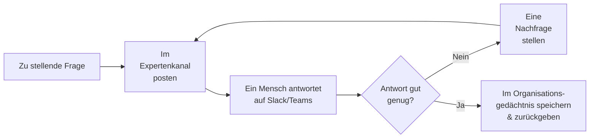

# Expert Coordinator Agent

Der **Expert Coordinator Agent** (der Experten-fragende Agent) ist die Brücke zwischen Ihren KI-Agents und Ihren
menschlichen Experten. Wenn eine Frage nicht automatisch beantwortet werden kann, postet dieser Agent sie in einen dafür
vorgesehenen Expertenkanal auf **Microsoft Teams oder Slack**, wartet auf eine Antwort einer Person, überprüft, ob die
Antwort die Frage tatsächlich beantwortet (und fragt bei Bedarf nach), und speichert die Antwort dann im
**Organisationsgedächtnis**, damit sie beim nächsten Mal automatisch wiederverwendet werden kann.

Normalerweise ist er nicht etwas, womit Endbenutzer direkt chatten. Stattdessen arbeitet er im Hintergrund — meistens
wird er vom [Company Knowledge Agent](../10_company_knowledge_agent/) aufgerufen, wenn dieser Agent keine dokumentierten
Antworten mehr findet. Sein Wert liegt in der **Wissenserfassung**: Jede Expertenkonsultation verwandelt eine einmalige
menschliche Antwort in wiederverwendbares organisatorisches Wissen.

## Was er tut

1. **Im Expertenkanal posten.** Der Agent sendet die Frage an den konfigurierten Teams- oder Slack-Kanal, in dem Ihre
   Experten anwesend sind.
2. **Auf eine menschliche Antwort warten.** Eine Person antwortet in diesem Kanal, in ihrem normalen Workflow – keine
   spezielle Software muss erlernt werden.
3. **Die Antwort überprüfen.** Ein Sprachmodell beurteilt, ob die Antwort die Frage tatsächlich beantwortet oder ob der
   Experte abgelehnt/nur teilweise geantwortet hat.
4. **Bei Bedarf nachfragen.** Wenn die Antwort unzureichend ist, formuliert der Agent eine gezielte Nachfrage und postet
   diese erneut in den Kanal – dies wird bis zu einer konfigurierbaren Anzahl von Runden wiederholt.
5. **Speichern und zurückgeben.** Sobald die Antwort ausreichend ist, speichert der Agent das Frage-Antwort-Paar im
   Organisationsgedächtnis und gibt die Antwort an den Fragesteller zurück (typischerweise den Company Knowledge Agent,
   der sie an den Benutzer weiterleitet).

::: tip Das ist "Bot-in-the-Loop"
Während andere Agents für den *Endbenutzer* pausieren (Human-in-the-Loop), pausiert der Expert Coordinator für einen
*anderen Menschen* — einen Fachexperten, der über einen Chatkanal erreicht wird. Der ursprüngliche Benutzer wartet nicht
im Chat; ihm wird mitgeteilt, dass die Frage weitergeleitet wurde und beantwortet wird, sobald ein Experte antwortet.
:::

## Wissenserfassung

Der Grund, diesen Agent anstelle einer E-Mail an einen Experten zu verwenden, ist, dass **jede Antwort erfasst wird**.
Wenn ein Experte einmal antwortet, werden die Frage und Antwort ins Organisationsgedächtnis geschrieben und sind für
jeden durchsuchbar. Das nächste Mal, wenn dasselbe Thema aufkommt, kann der
[Company Knowledge Agent](../10_company_knowledge_agent/) es aus diesem gespeicherten Wissen beantworten, ohne den
Experten erneut zu belästigen — so summiert sich der Aufwand des Experten mit der Zeit, anstatt in einem Chat-Thread
verloren zu gehen.

## Typische Szenarien

- **Eskalation an das Engineering.** Ein Company Knowledge Agent findet keine dokumentierte Antwort zu einem internen
  System, daher konsultiert er den Teams-Kanal des Engineering-Teams; die Antwort wird für zukünftige Fragen erfasst.
- **Spezialisten-Desk.** Eine kleine Gruppe von Fachexperten bearbeitet die wirklich neuen Fragen, während die KI alles
  bereits Dokumentierte handhabt.
- **Aufbau der Wissensdatenbank aus Konversationen.** Im Laufe der Zeit sammeln sich Expertenantworten im
  Organisationsgedächtnis an, wodurch die Notwendigkeit menschlicher Beteiligung stetig reduziert wird.

## Bevor Sie beginnen: Voraussetzungen

1. **Ein verbundener Teams- oder Slack-Bot.** Der Agent erreicht Experten über einen Bot, der auf Ihrer
   Kollaborationsplattform registriert ist. Diese Bot-Verbindung muss zuerst eingerichtet werden — siehe
   [Slack & Teams Integrationseinrichtung](../../17_slack_teams_integrations/1_setup/). Sie benötigen die Kanal- und
   Bot-Identifikatoren aus dieser Einrichtung, um die unten stehende Konfiguration auszufüllen.
2. **Ein Expertenkanal.** Ein Teams- oder Slack-Kanal, in dem Ihre Experten anwesend und bereit sind, Fragen zu
   beantworten.
3. **Ein Chat-Modell** zum Überprüfen von Antworten und zum Verfassen von Nachfragen, verfügbar über Ihre
   LiteLLM-Konfiguration.

## Einrichtung

Der Agent wird als **Blueprint** (Vorlage) bereitgestellt, aus dem Sie konfigurierte **Profile** erstellen — siehe
[Blueprints & Profile](../2_blueprints_and_profiles/). Mit den erfüllten Voraussetzungen:

1. **Öffnen Sie den Blueprint** unter **Admin > Agents > Blueprints** und wählen Sie **Expert Coordinator Agent** aus.
2. **Erstellen Sie ein Profil** mit einer **Agent-ID**, einem **Namen**, einer **Beschreibung** und einem **Icon**.
3. **Wählen Sie den Kanal** (Teams oder Slack) und tragen Sie dessen Identifikatoren ein (siehe Konfigurationsreferenz).
4. **Legen Sie das Ziel für das Organisationsgedächtnis fest**, damit erfasste Antworten dort gespeichert werden, wo
   Ihre Wissens-Agents sie lesen können.
5. **Wählen Sie das Chat-Modell** und passen Sie, falls gewünscht, die Anzahl der erlaubten Nachfrage-Runden an.
6. **Speichern.** Das Profil kann nun von einem Company Knowledge Agent angesprochen (oder direkt aufgerufen) werden.

::: warning Die Kanalkonfiguration befindet sich im Formular, nicht in Umgebungsvariablen
In früheren Versionen wurde der Kanal über Umgebungsvariablen (`EXPERT_ASKING_CHANNEL_TYPE`, `TEAMS_CHANNEL_ID`,
`SLACK_CHANNEL_ID`, …) festgelegt. Das ist nicht mehr der Fall — **alle Kanaleinstellungen sind jetzt Teil des
Konfigurationsformulars des Agents** und werden pro Profil in der Admin-Benutzeroberfläche bearbeitet. Wenn Sie
andernorts Referenzen auf diese Umgebungsvariablen finden, betrachten Sie diese als veraltet.
:::

## Konfigurationsreferenz

### Profilidentität

| Feld             | Typ                | Erforderlich | Beschreibung                                                                           |
| :--------------- | :----------------- | :----------- | :------------------------------------------------------------------------------------- |
| **Agent-ID**     | Text               | Ja           | Eindeutige, URL-sichere Kennung. Kleinbuchstaben, Ziffern, Unterstriche, Bindestriche. |
| **Name**         | Text (pro Sprache) | Ja           | Anzeigename.                                                                           |
| **Beschreibung** | Text (pro Sprache) | Ja           | Kurze Erklärung, wofür dieses Expertenprofil dient.                                    |
| **Icon**         | Icon-Auswahl       | Nein         | Visueller Identifikator.                                                               |

### Expertenkanal

Wählen Sie die Plattform aus und füllen Sie dann die Felder dieser Plattform aus. Die Identifikatoren stammen aus Ihrer
[Bot-Integrations-Einrichtung](../../17_slack_teams_integrations/1_setup/).

| Feld         | Typ     | Standard | Beschreibung                                                                |
| :----------- | :------ | :------- | :-------------------------------------------------------------------------- |
| **Kanaltyp** | Auswahl | `teams`  | Welche Plattform verwendet werden soll: **Microsoft Teams** oder **Slack**. |

**Wenn der Kanaltyp Microsoft Teams ist:**

| Feld             | Typ  | Erforderlich | Beschreibung                                         |
| :--------------- | :--- | :----------- | :--------------------------------------------------- |
| **Kanal-ID**     | Text | Ja           | Die Teams-Kanal-ID (Format wie `19:…@thread.tacv2`). |
| **Mandanten-ID** | Text | Ja           | Ihre Azure AD Mandanten-ID (eine UUID).              |
| **Bot-ID**       | Text | Ja           | Die Anwendungs-ID des Teams-Bots (eine UUID).        |

**Wenn der Kanaltyp Slack ist:**

| Feld            | Typ  | Standard                         | Beschreibung                                                                                                                 |
| :-------------- | :--- | :------------------------------- | :--------------------------------------------------------------------------------------------------------------------------- |
| **Kanal-ID**    | Text | —                                | Die Slack-Kanal-ID (beginnt mit `C`).                                                                                        |
| **Service-URL** | Text | `https://slack.botframework.com` | Bot Framework Service-URL. Verwenden Sie den EU-Endpunkt (`https://europe.slack.botframework.com`) für die EU-Datenresidenz. |

### Nachfrageverhalten

| Feld               | Typ  | Standard | Beschreibung                                                                                                  |
| :----------------- | :--- | :------- | :------------------------------------------------------------------------------------------------------------ |
| **Max. Schleifen** | Zahl | `3`      | Wie oft der Agent eine Nachfrage stellen darf, wenn die Antwort des Experten unvollständig ist. Bereich 1–10. |

### Sprachmodell

| Feld                                                                                      | Typ           | Standard | Beschreibung                                                                                                                              |
| :---------------------------------------------------------------------------------------- | :------------ | :------- | :---------------------------------------------------------------------------------------------------------------------------------------- |
| **Modell**                                                                                | Modellauswahl | —        | Das Chat-Modell, das verwendet wird, um die Vollständigkeit der Antwort zu beurteilen und Nachfragen zu verfassen. Erforderlich.          |
| **Temperatur**                                                                            | Zahl          | `0.0`    | Niedrig halten — dies ist eine Beurteilungs-/Extraktionsaufgabe, keine kreative. Bereich 0.0–2.0.                                         |
| **Log-Wahrscheinlichkeiten zurückgeben** / **Top Log-Wahrscheinlichkeiten** / **Timeout** | —             | —        | Standard-Sprachmodelloptionen, wie auf der Seite [Document Intelligence Assistant](../5_document_intelligence_assistant/#sprachmodell). |

### Organisationsgedächtnis

Wo erfasste Expertenantworten geschrieben werden. Gelesen von Wissens-Agents (wie dem Company Knowledge Agent), damit
Antworten automatisch wiederverwendet werden.

| Feld                              | Typ         | Standard                                          | Beschreibung                                                                                                                                             |
| :-------------------------------- | :---------- | :------------------------------------------------ | :------------------------------------------------------------------------------------------------------------------------------------------------------- |
| **Mandanten-ID**                  | Text        | Plattform-Standard                                | In den gemeinsam genutzten Speicher welches Mandanten geschrieben werden soll.                                                                           |
| **Erlaubte Namespaces**           | Liste       | *(leer)*                                          | Positivliste von Namespaces. Leer bedeutet uneingeschränkt. Validiert auch das Schreibziel.                                                              |
| **Standard-Namespace**            | Text        | Plattform-Standard                                | Der Namespace, in den Antworten geschrieben werden, wenn eine Anfrage keinen angibt. Muss in der Positivliste enthalten sein, falls eine festgelegt ist. |
| **Organisationsgedächtnisformat** | Langer Text | `Question: {question}\n\nExpert Answer: {answer}` | Vorlage für das gespeicherte Snippet. Verwenden Sie die Platzhalter `{question}` und `{answer}`.                                                         |

## Bewährte Praktiken

**Echte Experten in den Kanal einbinden.** Der Agent ist nur so gut wie die antwortenden Personen. Wählen Sie einen
Kanal, in dem kompetente Kollegen anwesend und bereit sind zu helfen.

**Den Namespace konsistent mit Ihren Wissens-Agents halten.** Damit erfasste Antworten wiederverwendet werden können,
schreiben Sie sie in einen Namespace, aus dem der [Company Knowledge Agent](../10_company_knowledge_agent/) (oder ein
RAG-Agent) tatsächlich liest.

**Das Nachfragelimit an die Geduld Ihrer Experten anpassen.** Zwei oder drei Runden sind in der Regel ausreichend; zu
viele können sich wie ein Verhör für den antwortenden Menschen anfühlen.

**Koppeln Sie ihn mit einem Company Knowledge Agent.** Allein leitet dieser Agent nur Fragen weiter. Seine wahre Stärke
kommt daher, dass er das Eskalationsziel eines [Company Knowledge Agent](../10_company_knowledge_agent/) ist, der ihn
nur konsultiert, wenn seine eigenen Dokumente nicht ausreichen.
