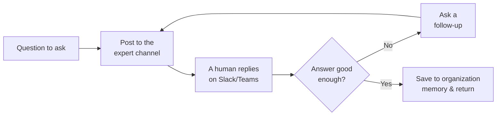

# Expert Coordinator Agent

The **Expert Coordinator Agent** (the expert-asking agent) is the bridge between your AI agents and your human experts.
When a question can't be answered automatically, this agent posts it to a designated expert channel on **Microsoft Teams
or Slack**, waits for a person to reply, checks whether the reply actually answers the question (asking follow-ups if
not), and then saves the answer into **organization memory** so it can be reused automatically next time.

It is usually not something end users chat with directly. Instead it works behind the scenes — most often invoked by the
[Company Knowledge Agent](../10_company_knowledge_agent/) when that agent runs out of documented answers. Its value is
**knowledge capture**: every expert consultation turns a one-off human answer into reusable organizational knowledge.

## What it does

1. **Post to the expert channel.** The agent sends the question to the configured Teams or Slack channel where your
   experts are.
2. **Wait for a human reply.** A person answers in that channel, in their normal workflow — no special tool to learn.
3. **Check the answer.** A language model judges whether the reply genuinely answers the question or whether the expert
   declined / answered only partially.
4. **Ask a follow-up if needed.** If the answer falls short, the agent composes a targeted follow-up question and posts
   it back to the channel — repeating up to a configurable number of rounds.
5. **Save and return.** Once the answer is sufficient, the agent stores the question-and-answer pair in organization
   memory and returns the answer to whoever asked (typically the Company Knowledge Agent, which relays it to the user).

::: tip This is "bot-in-the-loop"
Where other agents pause for the *end user* (human-in-the-loop), the Expert Coordinator pauses for a *different human* —
a subject-matter expert reached through a chat channel. The original user doesn't wait in the chat; they're told the
question was forwarded and will be answered when an expert replies.
:::

## Knowledge capture

The reason to use this agent rather than just emailing an expert is that **each answer is captured**. When an expert
answers once, the Q&A is written to organization memory and becomes searchable for everyone. The next time the same
topic comes up, the [Company Knowledge Agent](../10_company_knowledge_agent/) can answer it from that stored knowledge
without bothering the expert again — so the expert's effort compounds over time instead of being lost in a chat thread.

## Typical scenarios

- **Engineering escalation.** A Company Knowledge Agent can't find a documented answer about an internal system, so it
  consults the engineering team's Teams channel; the answer is captured for future questions.
- **Specialist desk.** A small group of subject-matter experts fields the genuinely novel questions while the AI handles
  everything already documented.
- **Building the knowledge base from conversations.** Over time, expert answers accumulate in organization memory,
  steadily reducing how often a human needs to be involved.

## Before you start: prerequisites

1. **A connected Teams or Slack bot.** The agent reaches experts through a bot registered on your collaboration
   platform. That bot connection must be set up first — see
   [Slack & Teams integration setup](../../17_slack_teams_integrations/1_setup/). You'll need the channel and bot
   identifiers from that setup to fill in the configuration below.
2. **An expert channel.** A Teams or Slack channel where your experts are present and willing to answer questions.
3. **A chat model** for checking answers and composing follow-ups, available through your LiteLLM configuration.

## Setting it up

The agent is delivered as a **blueprint** from which you create configured **profiles** — see
[Blueprints & Profiles](../2_blueprints_and_profiles/). With the prerequisites in place:

1. **Open the blueprint** under **Admin > Agents > Blueprints** and select **Expert Coordinator Agent**.
2. **Create a profile** with an **Agent ID**, **Name**, **Description**, and **Icon**.
3. **Choose the channel** (Teams or Slack) and fill in its identifiers (see the configuration reference).
4. **Set the organization-memory target** so captured answers are written where your knowledge agents can read them.
5. **Choose the chat model** and, if you like, adjust how many follow-up rounds are allowed.
6. **Save.** The profile can now be targeted by a Company Knowledge Agent (or invoked directly).

::: warning Channel configuration lives in the form, not in environment variables
In earlier versions the channel was set through environment variables (`EXPERT_ASKING_CHANNEL_TYPE`, `TEAMS_CHANNEL_ID`,
`SLACK_CHANNEL_ID`, …). That is no longer the case — **all channel settings are now part of the agent's configuration
form** and are edited per profile in the Admin UI. If you find references to those environment variables elsewhere,
treat them as outdated.
:::

## Configuration reference

### Profile identity

| Field           | Type                | Required | Description                                                                   |
| --------------- | ------------------- | -------- | ----------------------------------------------------------------------------- |
| **Agent ID**    | Text                | Yes      | Unique, URL-safe identifier. Lowercase letters, digits, underscores, hyphens. |
| **Name**        | Text (per language) | Yes      | Display name.                                                                 |
| **Description** | Text (per language) | Yes      | Short explanation of what this expert profile is for.                         |
| **Icon**        | Icon picker         | No       | Visual identifier.                                                            |

### Expert channel

Pick the platform, then fill in that platform's fields. The identifiers come from your
[bot integration setup](../../17_slack_teams_integrations/1_setup/).

| Field            | Type   | Default | Description                                              |
| ---------------- | ------ | ------- | -------------------------------------------------------- |
| **Channel Type** | Choice | `teams` | Which platform to use: **Microsoft Teams** or **Slack**. |

**When Channel Type is Microsoft Teams:**

| Field          | Type | Required | Description                                             |
| -------------- | ---- | -------- | ------------------------------------------------------- |
| **Channel ID** | Text | Yes      | The Teams channel ID (format like `19:…@thread.tacv2`). |
| **Tenant ID**  | Text | Yes      | Your Azure AD tenant ID (a UUID).                       |
| **Bot ID**     | Text | Yes      | The Teams bot's application ID (a UUID).                |

**When Channel Type is Slack:**

| Field           | Type | Default                          | Description                                                                                                     |
| --------------- | ---- | -------------------------------- | --------------------------------------------------------------------------------------------------------------- |
| **Channel ID**  | Text | —                                | The Slack channel ID (starts with `C`).                                                                         |
| **Service URL** | Text | `https://slack.botframework.com` | Bot Framework service URL. Use the EU endpoint (`https://europe.slack.botframework.com`) for EU data residency. |

### Follow-up behaviour

| Field         | Type   | Default | Description                                                                                      |
| ------------- | ------ | ------- | ------------------------------------------------------------------------------------------------ |
| **Max loops** | Number | `3`     | How many times the agent may ask a follow-up when the expert's answer is incomplete. Range 1–10. |

### Language model

| Field                                                                  | Type         | Default | Description                                                                                                                              |
| ---------------------------------------------------------------------- | ------------ | ------- | ---------------------------------------------------------------------------------------------------------------------------------------- |
| **Model**                                                              | Model picker | —       | The chat model used to judge answer sufficiency and write follow-up questions. Required.                                                 |
| **Temperature**                                                        | Number       | `0.0`   | Keep low — this is a judgement/extraction task, not a creative one. Range 0.0–2.0.                                                       |
| **Return Log Probabilities** / **Top Log Probabilities** / **Timeout** | —            | —       | Standard language-model options, as on the [Document Intelligence Assistant](../5_document_intelligence_assistant/#language-model) page. |

### Organization memory

Where captured expert answers are written. Read by knowledge agents (such as the Company Knowledge Agent) so answers are
reused automatically.

| Field                          | Type      | Default                                           | Description                                                                                                       |
| ------------------------------ | --------- | ------------------------------------------------- | ----------------------------------------------------------------------------------------------------------------- |
| **Tenant ID**                  | Text      | platform default                                  | Which tenant's shared memory to write to.                                                                         |
| **Allowed namespaces**         | List      | *(empty)*                                         | Allow-list of namespaces. Empty means unrestricted. Also validates the write target.                              |
| **Default namespace**          | Text      | platform default                                  | The namespace answers are written to when a request doesn't specify one. Must be in the allow-list if one is set. |
| **Organization Memory Format** | Long text | `Question: {question}\n\nExpert Answer: {answer}` | Template for the stored snippet. Use `{question}` and `{answer}` placeholders.                                    |

## Best practices

**Put real experts in the channel.** The agent is only as good as the people answering. Choose a channel where
knowledgeable colleagues are present and willing to help.

**Keep the namespace consistent with your knowledge agents.** For captured answers to be reused, write them to a
namespace that the [Company Knowledge Agent](../10_company_knowledge_agent/) (or a RAG agent) actually reads from.

**Tune the follow-up limit to your experts' patience.** Two or three rounds is usually enough; too many can feel like an
interrogation to the human answering.

**Pair it with a Company Knowledge Agent.** On its own this agent just relays questions. Its real power comes from being
the escalation target of a [Company Knowledge Agent](../10_company_knowledge_agent/), which only consults it when its
own documents fall short.
