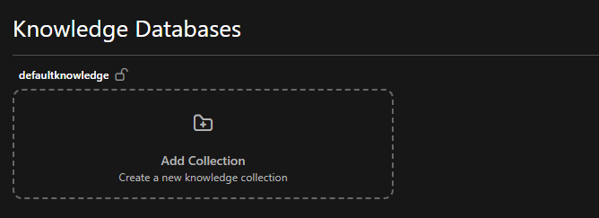

```markdown
---
title: Wissensmanagement
source_sha: "568b93d4cf2e2690f094b1baff79f9679b7b3c619424b2afbbc96ac3791296b1"
---

# Wissensmanagement

KI-Agents benötigen Zugang zu relevanten Informationen, um Fragen präzise beantworten zu können. Das Wissensmanagementsystem verarbeitet Ihre Dokumente und macht sie durch semantische Suche auffindbar.

## Struktur

Wissen ist in drei Ebenen organisiert:

Wissensdatenbanken sind isolierte Container auf der obersten Ebene. Jede Datenbank verfügt über eigene Daten, Berechtigungen und eine eigene Verarbeitungspipeline. Organisationen erstellen Datenbanken typischerweise pro Abteilung, Projekt oder Sicherheitsklassifikation.

Namespaces (in der Benutzeroberfläche „Sammlungen“ genannt) gruppieren verwandte Dokumente innerhalb einer Datenbank. Sie funktionieren wie Ordner, die nach Thema oder Zweck organisiert sind. Eine Produktdatenbank könnte „technische Informationen“, „Anleitungen“ und „Fehlerbehebung“ Sammlungen enthalten.

Dokumente sind die eigentlichen Dateien – PDFs, Word-Dokumente, PowerPoint-Präsentationen. Das System verarbeitet sie automatisch nach dem Hochladen.

::: info Mehrsprachige Unterstützung
Datenbanknamen, Namespace-Bezeichnungen und Ordnerbeschreibungen unterstützen Deutsch, Englisch, Französisch und Italienisch. Die Benutzeroberfläche zeigt Bezeichnungen entsprechend der Sprachpräferenz des Benutzers an.
:::

## Inhalte verwalten

### Manuelle Verwaltung

Standardmäßig ermöglichen Datenbanken eine manuelle Kontrolle:

1.  Sammlungen über die Weboberfläche erstellen
2.  Dokumente in bestimmte Sammlungen hochladen
3.  Auf den nächsten geplanten Pipeline-Lauf warten



Sie steuern, was hochgeladen wird und wo es sich befindet. Die Pipeline läuft nach einem Zeitplan (üblicherweise für die nächtliche Verarbeitung konfiguriert), um die Dokumentenverarbeitung und -indexierung zu handhaben.

### Automatische Synchronisierung von externen Quellen

Markieren Sie eine Datenbank als "Auto-Sync", um sie mit externen Inhaltsquellen wie SharePoint zu verbinden. Das System dann:

-   Synchronisiert Dateien von der externen Quelle nach einem Zeitplan (typischerweise nächtlich)
-   Erstellt automatisch Sammlungen aus der Ordnerstruktur
-   Verarbeitet neue Inhalte während des geplanten Pipeline-Laufs
-   Deaktiviert manuelle Uploads über die Benutzeroberfläche

Das externe System wird zur Quelle der Wahrheit. Ihr Team arbeitet weiterhin in SharePoint, und die Sync-Pipeline bringt Änderungen gemäß dem konfigurierten Zeitplan in den Swiss AI Hub.

## Dokumentenverarbeitung

Das System verarbeitet jedes hochgeladene Dokument in mehreren Phasen:

Parsing: MinerU extrahiert Text, Tabellen, Abbildungen und Strukturen aus PDFs und Office-Dokumenten. Es verarbeitet komplexe Layouts, mehrspaltige Seiten und eingebettete Inhalte unter Beibehaltung der logischen Struktur.

Chunking: Große Dokumente werden in kleinere Stücke aufgeteilt, die den Kontext beibehalten. Ein 50-seitiges Handbuch wird zu Hunderten von Chunks, wobei jeder seine Beziehung zum umgebenden Inhalt bewahrt.

Metadatenextraktion: Das System erfasst Erstellungsdaten, Autoren, Quellinformationen und die erkannte Sprache. Agents können Ergebnisse mithilfe dieser Metadaten filtern.

Vektor-Embedding: Text-Chunks werden in Vektordarstellungen umgewandelt, die semantische Bedeutung erfassen. Agents finden relevante Inhalte basierend auf Konzepten, nicht nur auf Keyword-Matching. Eine Abfrage über „Fahrzeuggeschwindigkeitsbegrenzungen“ findet Inhalte über „maximale Geschwindigkeitsbeschränkungen“.

## Inspektion und Debugging

Das System bietet Einblick in die Dokumentenverarbeitung:

Dokumentenrekonstruktion zeigt, wie der Parser Ihr Dokument interpretiert hat. Prüfen Sie, ob Tabellen, Seitenleisten und andere strukturelle Elemente korrekt identifiziert wurden.

Chunk-Inspektion zeigt an, wie das System Inhalte segmentiert, welche Metadaten es extrahiert hat und wie es Chunks für den Abruf darstellt. Nützlich, wenn Agents erwartete Inhalte nicht finden.

Verarbeitungsstatus gibt an, ob Dokumente hochgeladen, verarbeitet oder bereit sind.

## Zugriffskontrolle

Das Berechtigungssystem steuert alle Wissensoperationen:

-   Das Anzeigen von Datenbanken erfordert entsprechende Berechtigungen
-   Der Zugriff auf Namespaces prüft die Benutzerautorisierung
-   Das Hochladen von Dokumenten validiert Benutzerrechte
-   Die Überprüfung von Verarbeitungsdetails erfordert eine Berechtigung

Wissensdatenbanken bieten natürliche Isolationsgrenzen. Organisationen können separate Datenbanken pro Abteilung oder Projekt erstellen und dann Berechtigungen verwenden, um zu steuern, wer auf jede Datenbank zugreift.

## Agenten-Integration

Agents verbinden sich mit bestimmten Sammlungen und nicht mit ganzen Datenbanken. Beim Konfigurieren eines Agents legen Sie fest, welche Sammlungen er durchsuchen kann. Ein Kundensupport-Agent könnte auf „Produkte“ und „FAQ“ zugreifen, aber nicht auf „Engineering“.

Sammlungsbezogener Abruf hält Agents auf relevante Inhalte fokussiert und verbessert sowohl Geschwindigkeit als auch Genauigkeit.

Dokumente werden für Agents verfügbar, nachdem die Pipeline sie verarbeitet hat. Das System verfolgt, welche Quelldokumente Agents verwendet haben, was die Zitation und Verifizierung von Antworten ermöglicht.

## Technische Implementierung

Die Architektur verwendet:

-   FerretDB für Dokumentenmetadaten und Verarbeitungsstatus
-   Milvus für Vektorspeicherung und semantische Suche
-   MinerU für Dokumenten-Parsing und Strukturextraktion
-   SeaweedFS für S3-kompatiblen Dateispeicher
-   LlamaIndex für Chunking und Embedding-Orchestrierung

Verarbeitungsmetadaten befinden sich in FerretDB, Vektor-Embeddings in Milvus, Rohdateien in SeaweedFS. Diese Trennung optimiert jede Komponente für ihre spezifische Aufgabe.

## Einschränkungen

Keine gemischten Modi: Eine Datenbank ist entweder manuell verwaltet oder automatisch synchronisiert, nicht beides. Dies verhindert Mehrdeutigkeiten bezüglich der Inhaltsquellen.

Keine manuelle Chunk-Bearbeitung: Das System generiert Chunks automatisch aus Quelldokumenten. Um inkorrekte Chunks zu korrigieren, aktualisieren Sie das Quelldokument und verarbeiten Sie es erneut.

Kein Datenbank-Merging: Datenbanken bleiben designbedingt isoliert. Eine Reorganisation erfordert das Erstellen neuer Strukturen und das Migrieren von Dokumenten.
```
