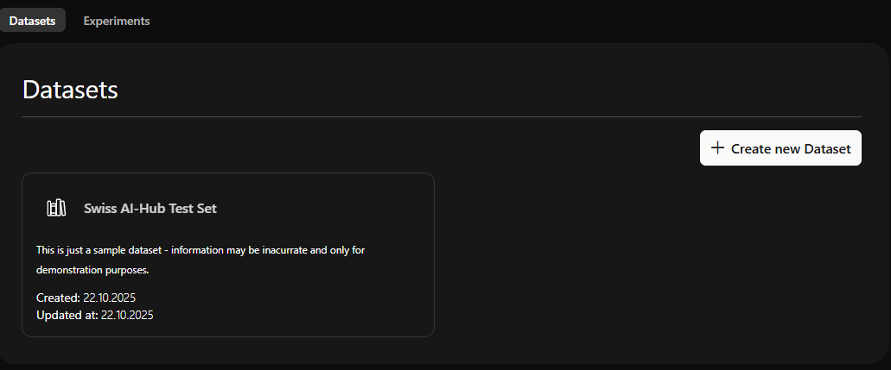

# Agenten-Evaluierungen

Agenten-Evaluierungen testen und messen die Qualität von KI-Agents vor und nach dem Deployment. Sie erhalten Daten darüber, ob Ihre Agents genaue, vollständige und prägnante Antworten liefern.

Evaluierungen testen Agents anhand vordefinierter Fragen mit bekannten korrekten Antworten. Experimente werden in [Langfuse](https://langfuse.com) durchgeführt, dem integrierten LLM-Observability-Tool der Plattform. Der Swiss AI Hub provisioniert automatisch alles, was Langfuse benötigt — Ihre Agents, eine Agent-Aufrufverbindung, Evaluator-Modelle und eine Prompt-Vorlage — damit Sie sich auf drei Schritte konzentrieren können:

1.  **Erstellen Sie einen Datensatz** mit Fragen und Referenzantworten.
2.  **Erstellen Sie Evaluatoren**, die Agenten-Antworten bewerten.
3.  **Führen Sie Experimente durch** gegen Ihren Agenten und überprüfen Sie die Ergebnisse.

::: tip
Diese Seite beschreibt nur den Workflow des Swiss AI Hub. Für Langfuse-spezifische Details (Formate für den Datensatz-Upload, Evaluator-Konfiguration, Experiment-Vergleich), lesen Sie die [Langfuse-Dokumentation](https://langfuse.com/docs).
:::

## 1. Datensatz erstellen

Datensätze sind Sammlungen von Testfragen mit Referenzantworten. Behandeln Sie repräsentative Fragen, die Ihr Agent erhalten wird, und fügen Sie klare Referenzantworten sowie Edge Cases hinzu. Beginnen Sie mit mindestens 10 Frage-Antwort-Paaren; 20-50 funktionieren besser.

Sie können einen Datensatz auf zwei Arten erstellen:

-   **In der Swiss AI Hub Admin UI** — öffnen Sie `Datasets`, geben Sie einen Namen und eine Beschreibung ein, fügen Sie Ihre Frage-Antwort-Paare hinzu und speichern Sie diese dann.
-   **In Langfuse** — erstellen Sie den Datensatz direkt, zum Beispiel durch das Hochladen einer CSV-Datei mit einer Zeile pro Frage-Antwort-Paar.

In beiden Fällen wird der Datensatz in Langfuse gespeichert und steht sofort für Experimente zur Verfügung.

 *Datensatz-Übersicht in der Admin UI*

 *Hinzufügen von Testfragen mit Referenzantworten*

::: warning In der Admin UI erstellte Datensätze sind nur zum Anhängen
Beim Bearbeiten in der Admin UI können Sie jederzeit neue Frage-Antwort-Paare hinzufügen, aber Sie können Elemente nach dem Speichern weder entfernen noch bearbeiten. Um eine Frage zu ändern, fügen Sie ein korrigiertes Element hinzu oder bearbeiten Sie den Datensatz in Langfuse.
:::

## 2. Evaluatoren erstellen

Evaluatoren bewerten jede Agenten-Antwort, typischerweise unter Verwendung von LLM-as-a-judge. Konfigurieren Sie diese in Langfuse. Der Swiss AI Hub provisioniert eine dedizierte Evaluator LLM-Verbindung (`AI-Hub LLM (Evaluators)`), sodass Bewertungsmodelle sofort verfügbar sind.

Empfohlene Bewertungsdimensionen:

| Metrik          | Was gemessen wird                                                                                             |
| --------------- | ------------------------------------------------------------------------------------------------------------- |
| Korrektheit     | Faktische Genauigkeit im Vergleich zur Referenzantwort. Frei von Fehlinformationen, Halluzinationen oder Widersprüchen. |
| Vollständigkeit | Behandelt alle Teile der Anfrage, einschliesslich mehrteiliger Fragen und impliziter Bedürfnisse.            |
| Prägnanz        | Effizient und direkt. Vermeidet irrelevante Abschweifungen, Redundanzen oder übermässige Füllwörter.          |

## 3. Experimente durchführen

Öffnen Sie eine Datensatzkarte in der Admin UI und klicken Sie auf **Run Experiments**, um zum Datensatz in Langfuse zu springen. Erstellen Sie dort ein Experiment:

-   **Wählen Sie den zu testenden Agenten aus.** Online-Agents erscheinen automatisch als auswählbare Modelle, benannt als `<agent_class>/<agent_id>` — der Swiss AI Hub synchronisiert laufende Agents kontinuierlich mit Langfuse, sodass keine manuelle Registrierung erforderlich ist.
-   **Verwenden Sie die `ai-hub-agent` Prompt-Vorlage.** Diese automatisch bereitgestellte Vorlage ordnet jede Datensatzfrage einer Anfrage an den OpenAI-kompatiblen Endpunkt des Agenten zu, sodass Langfuse Ihren echten Agenten über die Plattform aufruft.
-   **Fügen Sie die Evaluatoren** aus Schritt 2 hinzu und führen Sie das Experiment aus.

Führen Sie Experimente durch, bevor Sie einen neuen Agenten deployen, nach wesentlichen Änderungen an dessen Konfiguration oder Wissensbasis und regelmässig zur Qualitätsüberwachung. Jeder Durchlauf wird in Langfuse gespeichert, sodass Sie die Durchläufe nebeneinander vergleichen können, um zu bestätigen, dass eine Änderung die Qualität verbessert hat.

Bei der Interpretation der Ergebnisse: Eine geringe Korrektheit weist normalerweise auf Lücken in der Wissensbasis oder Retrieval-Probleme hin, eine geringe Vollständigkeit auf übersehene Teile mehrteiliger Fragen und eine geringe Prägnanz auf übermässig ausführliche Antworten. Passen Sie die Wissensbasis, Systemprompts oder Retrieval-Einstellungen des Agenten entsprechend an und führen Sie das Experiment dann erneut durch, um Verbesserungen zu überprüfen.

## Nicht implementierte Funktionen

Die folgenden Funktionen sind derzeit nicht implementiert:

-   Bias-Monitoring und Model-Drift-Erkennung: Keine automatisierte Bias-Erkennung, Fairness-Metriken oder Drift-Erkennung. Langfuse-Experimente und OpenTelemetry-Tracing bieten grundlegende Funktionen, die erweitert werden könnten.

-   Produktions-A/B-Testing: Keine integrierte Traffic-Splitting oder parallele Tests von Agenten-Varianten in der Produktion. Der Vergleich vor dem Deployment über Langfuse-Experimente wird unterstützt.

