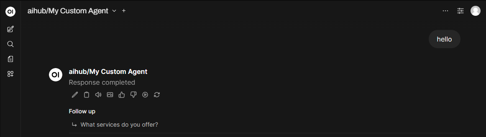
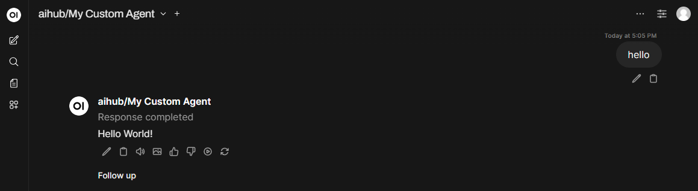
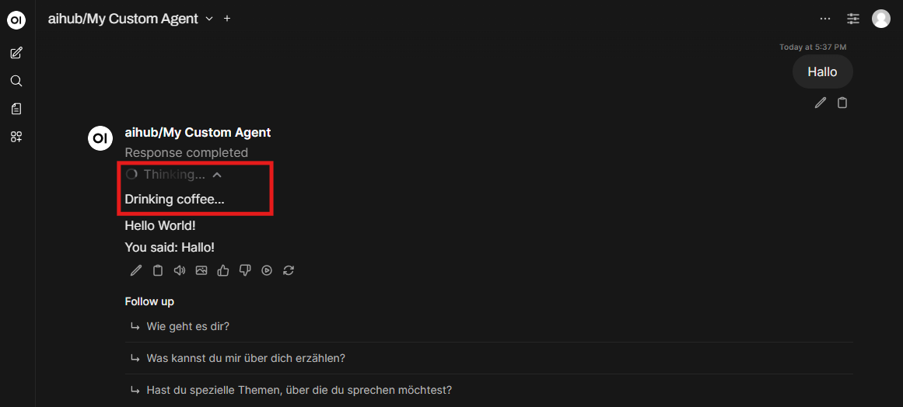

# Your First Agent

Build your first agent using the Swiss AI Hub Agent (`aihub_agent`) SDK - a simple message processing agent with a
2-step workflow.

## What you'll learn

This quickstart covers the essential building blocks:

- **Agent structure**: How agents process messages in steps
- **Event flow**: Data flowing between workflow steps
- **Configuration**: Settings that control agent behavior
- **Testing**: Running your agent locally

## Prerequisites

You need the Swiss AI Hub development environment running. Before you start, make sure you completed the
[Development Environment Setup](../1_dev_environment_setup/) steps.

## How agents work

Swiss AI Hub agents are **event-driven workflows** with three essential parts:

- **Steps**: Functions decorated with `@step()` that process events
- **Events**: Data objects flowing between steps
- **Configuration**: Typed settings that control agent behavior

## Some Basic Concepts to start with!

Let's look at the default agent created in the setup of the development environment:

```python
import logging

from aihub_agent.agents.Agent import Agent
from aihub_lib.nats.events.user import UserMessageEvent
from aihub_lib.nats.events import StopEvent
from aihub_agent.workflow.decorators.step import step

logger = logging.getLogger(__name__)


class MyCustomAgent(Agent):

    @step()
    async def start_step(
        self,
        event: UserMessageEvent,
    ) -> StopEvent:
        content = event.messages[-1].content
        print(f"[Step 1]: UserMessageEvent: {content}")
        hello_world_message = "Hello World!\n"
        return StopEvent(final_message=hello_world_message)
```

When you start the UI and try to use the Agent in the OpenWebUI. You notice that the agent does not respond.



### Use Chunk Events to display live Chat Responses

The reason you don't see a response in the chat interface is that only special events (`DisplayEvents`) are displayed in
the UI. And for Chat interfaces especially the Response is composed from `ChunkEvent`'s. So let's enable our step to
display such a `ChunkEvent`. For this we need to use use the `EventDisplayer` in the step-function and await the
`display_chunk` methodm with a first argument of the content to display, and as a second argument we can pass the source
of this chunk. Usually this is the model name or the Language model that produces this chunk. Since in our case we hard
code the chunk for now let's just use the ClassName of the Agent as source.

```python
import logging

from aihub_agent.agents.Agent import Agent
from aihub_lib.nats.events.user import UserMessageEvent
from aihub_lib.nats.events import StopEvent
from aihub_agent.workflow.decorators.step import step
from aihub_lib.displayers.EventDisplayer import EventDisplayer # [!code ++]

logger = logging.getLogger(__name__)


class MyCustomAgent(Agent):

    @step()
    async def start_step(
        self,
        event: UserMessageEvent,
        displayer: EventDisplayer, # [!code ++]
    ) -> StopEvent:
        content = event.messages[-1].content
        print(f"[Step 1]: UserMessageEvent: {content}")
        hello_world_message = "Hello World!\n"
        await displayer.display_chunk(hello_world_message, "MyCustomAgent") # [!code ++]
        return StopEvent(final_message=hello_world_message)
```

How we see that the Agent responds with an actual message.



### See the power of streaming

As you might know from other AI Tools, large language models produce their responses chunk by chunk. Instead of just
displaying the response as a whole at the end we can build up the final response part by part which enables us to show
the user some part of the response as quickly as possible. let's demonstrate:

```python
import logging
import asyncio # [!code ++]

from aihub_agent.agents.Agent import Agent
from aihub_lib.nats.events.user import UserMessageEvent
from aihub_lib.nats.events import StopEvent
from aihub_agent.workflow.decorators.step import step
from aihub_lib.displayers.EventDisplayer import EventDisplayer

logger = logging.getLogger(__name__)


class MyCustomAgent(Agent):

    @step()
    async def start_step(
        self,
        event: UserMessageEvent,
        displayer: EventDisplayer,
    ) -> StopEvent:
        content = event.messages[-1].content
        print(f"[Step 1]: UserMessageEvent: {content}")
        hello_world_message = "Hello World!\n"
        await displayer.display_chunk(hello_world_message, "MyCustomAgent")
        await asyncio.sleep(2) # [!code ++]
        repeat_message = f"You said: {content}!\n" # [!code ++]
        await displayer.display_chunk(repeat_message, "MyCustomAgent") # [!code ++]
        return StopEvent(final_message=hello_world_message)
```

We just added a second chunk that is displayed. When you run the agent again now you see that it will responde with
`Hello World!` first and after 2 seconds answers with `You said: Hello!`\
<video controls="controls" src="../../../../media/sdk/your_first_agent/show_chunk_delay.mp4" type="video/mp4" />

### Add some thinking steps

Especially when the agent need longer to finalize it's result it is good practice to inform the user about what is going
on in the agent. To allow this you can display `ThoughtEvent`'s. Again we use the `EventDisplayer` but this time with
the `display_thought` method.

```python
import logging
import asyncio

from aihub_agent.agents.Agent import Agent
from aihub_lib.nats.events.user import UserMessageEvent
from aihub_lib.nats.events import StopEvent
from aihub_agent.workflow.decorators.step import step
from aihub_lib.displayers.EventDisplayer import EventDisplayer

logger = logging.getLogger(__name__)


class MyCustomAgent(Agent):

    @step()
    async def start_step(
        self,
        event: UserMessageEvent,
        displayer: EventDisplayer,
    ) -> StopEvent:
        content = event.messages[-1].content
        print(f"[Step 1]: UserMessageEvent: {content}")
        await displayer.display_thought("Drinking coffee...")  # [!code ++]
        hello_world_message = "Hello World!\n"
        await displayer.display_chunk(hello_world_message, "MyCustomAgent")
        await asyncio.sleep(2)
        repeat_message = f"You said: {content}!\n"
        await displayer.display_chunk(repeat_message, "MyCustomAgent")
        return StopEvent(final_message=hello_world_message)
```

Now you see there is an additional section in the response called `Thinking...` if you expand it you can see our thought
that has been created with the content `Drinking coffee...`


## Create your first Multistep Agent

### 1. Create a Custom Event (`events/MyCustomAgentEvent.py`):

First, create an event to pass data between steps:

```python
from typing import Annotated

from aihub_lib.nats.events import ControlEvent
from pydantic import Field


class MyCustomAgentEvent(ControlEvent):
    word_count: Annotated[int, Field(description="The word count of the processed content")]

```

### 2. Adjust Agent Implementation (`MyCustomAgent.py`):

```python
import logging
import asyncio

from aihub_agent.agents.Agent import Agent
from aihub_lib.nats.events.user import UserMessageEvent
from aihub_lib.nats.events import StopEvent
from aihub_agent.workflow.decorators.step import step
from aihub_lib.displayers.EventDisplayer import EventDisplayer

from .events.MyCustomAgentEvent import MyCustomAgentEvent # [!code ++]

logger = logging.getLogger(__name__)


class MyCustomAgent(Agent):

    @step()
    async def start_step(
        self,
        event: UserMessageEvent,
        displayer: EventDisplayer,
    ) -> MyCustomAgentEvent:
        content = event.messages[-1].content
        print(f"[Step 1]: UserMessageEvent: {content}")
        await displayer.display_thought("Drinking coffee...")
        hello_world_message = "Hello World!\n"
        await displayer.display_chunk(hello_world_message, "MyCustomAgent")
        await asyncio.sleep(2)
        repeat_message = f"You said: {content}!\n"
        await displayer.display_chunk(repeat_message, "MyCustomAgent")
        word_count = len(content.split()) # [!code ++]
        return MyCustomAgentEvent(word_count=word_count) # [!code ++]
        return StopEvent(final_message=hello_world_message) # [!code --]

    @step() # [!code ++]
    async def stop_step( # [!code ++]
        self, # [!code ++]
        event: MyCustomAgentEvent, # [!code ++]
        displayer: EventDisplayer, # [!code ++]
    ) -> StopEvent: # [!code ++]
        await displayer.display_chunk(f"The word count is {event.word_count} words\n", "MyCustomAgent") # [!code ++]
        return StopEvent() # [!code ++]
```

Now you have an first agent that acts in two steps. in the first step we do everything we have done in the past but also
we count the number of words in the user message. This information is then passed to a second step where we also add to
the response `The word count is X words` where X is the number of words we have counted in the first step. We have
connected the two steps by defining out new Event `MyCustomAgentEvent` as the output of the first step and as input to
the second step.

If you Navigate to the Agent Overview, select you agent there and then go to `Workflow`, then you can see the Workflow
and the steps of your agent. You can see which steps are defined and which input and output events these steps have.


### 3. Add some Agent Configuration (`MyCustomAgentConfig.py`):

Often you want to have your agent configurable when you start it. For this you can use the Configuation Class. When you
set up your agent using the CLI then a basic Configuration File has already been created for you looking like this:

```python
from typing import Annotated

from pydantic import Field
from aihub_lib.agents.AgentConfig import AgentConfig


class MyCustomAgentConfig(AgentConfig):
    """Configuration class for My First Agent Agent."""

    config_value: Annotated[str, Field(
        default="Default Config Value",
        description="Some configuration value for the agent"
    )]
```

We can access this configuration in every step if we need to. For example can we read the content of the field
`config_value` in the second step of our agent and post it's string value also as a chunk. However usually you use the
config to configure some logic in your steps, either with system-prompts or configurations to some methods.

```python
import logging
import asyncio

from aihub_agent.agents.Agent import Agent
from aihub_lib.nats.events.user import UserMessageEvent
from aihub_lib.nats.events import StopEvent
from aihub_agent.workflow.decorators.step import step
from aihub_lib.displayers.EventDisplayer import EventDisplayer

from .events.MyCustomAgentEvent import MyCustomAgentEvent
from .MyCustomAgentConfig import MyCustomAgentConfig  # [!code ++]

logger = logging.getLogger(__name__)


class MyCustomAgent(Agent):

    @step()
    async def start_step(
        self,
        event: UserMessageEvent,
        displayer: EventDisplayer,
    ) -> MyCustomAgentEvent:
        content = event.messages[-1].content
        print(f"[Step 1]: UserMessageEvent: {content}")
        await displayer.display_thought("Drinking coffee...")
        hello_world_message = "Hello World!\n"
        await displayer.display_chunk(hello_world_message, "MyCustomAgent")
        await asyncio.sleep(2)
        repeat_message = f"You said: {content}!\n"
        await displayer.display_chunk(repeat_message, "MyCustomAgent")
        word_count = len(content.split())
        return MyCustomAgentEvent(word_count=word_count)

    @step()
    async def stop_step(
        self,
        event: MyCustomAgentEvent,
        config: MyCustomAgentConfig,  # [!code ++]
        displayer: EventDisplayer,
    ) -> StopEvent:
        await displayer.display_chunk(f"The word count is {event.word_count} words\n", "MyCustomAgent")
        await displayer.display_chunk(f"My config sais: {config.config_value}", "MyCustomAgent")
        return StopEvent()
```

You can set the configuration values in your `trigger.py` or when you build the agent the in the `main.py`

```python{10}
async def main():
    runner = AgentRunner(
        agent_type=MyCustomAgent,
        agent_config=MyCustomAgentConfig(
            agent_class=MyCustomAgent.__name__,
            agent_id="my_custom_agent",
            name=LocaleString(en="My Custom Agent"),
            description=LocaleString(en="This is a simple agent created from a template."),
            config_value="My first Config Value"
        ),
    )

    await runner.run_forever()


if __name__ == "__main__":
    asyncio.run(main())
```

### 4. Test Script (`trigger.py`):

## Run and debug your agent

1. **Run the test script**:

To quickly test your agent you can write a `trigger.py` script which starts the agent and posts it's StartEvent. This
way you can test the agent without any UI.

::: code-group

```python [trigger.py]
import asyncio
from aihub_lib.i18n.LocaleString import LocaleString
from aihub_lib.nats.events import UserMessageEvent
from aihub_lib.testing.auth_utils.fake_user import fake_user
from aihub_lib.infrastructure.logging.logger import enable_logging
from aihub_agent.runners.AgentTestRunner import AgentTestRunner
from llama_index.core.base.llms.types import ChatMessage, MessageRole

from MyAgent import MyAgent
from MyAgentConfig import MyAgentConfig

# Enable detailed logging to see event flow
enable_logging()

async def main():
    # Configure the agent
    config = MyAgentConfig(
        agent_class=MyCustomAgent.__name__,
        agent_id="my_custom_agent",
        name=LocaleString(en="My Custom Agent"),
        description=LocaleString(en="This is a simple agent created from a template."),
        config_value="My first Config Value"
    )
    
    # Create test runner
    runner = AgentTestRunner(agent_type=MyAgent, agent_config=config)
    
    # Run the agent with a test message
    async with runner.test_run() as topic:
        await runner.send_event_from_topic(
            topic=topic,
            start_event=UserMessageEvent(
                messages=[ChatMessage(
                    content="Hello world this is my first agent",
                    role=MessageRole.USER
                )],
                user=fake_user()
            )
        )
    
    print(f"Agent completed: {runner.has_stop_event}")

if __name__ == "__main__":
    asyncio.run(main())
```

```bash
python trigger.py
```

Expected output:

```
[Step 1] Processing message: 'Hello world this is my first agent' -> 'HELLO WORLD THIS IS MY FIRST AGENT'
[Step 2] Creating response: 'Processed: HELLO WORLD THIS IS MY FIRST AGENT (Words: 7)'
Agent completed: True
```

2. **Debug with Langfuse Tracing** - Open `http://localhost:6006` to see:

   - Step-by-step execution flow
   - Event data flowing between steps
   - Timing and performance metrics
   - Event payload details

3. **Check the logs** - The `enable_logging()` call shows real-time event flow and helps debug issues.

## Understanding the workflow

Your agent follows this event flow:

1. **UserMessageEvent** → `process_message()` → **MessageEvent**
2. **MessageEvent** → `create_response()` → **StopEvent**

Each step:

- Receives an event as input
- Processes the data
- Returns a new event
- The workflow engine routes events to the next step

## What you learned

- **Event-driven workflows**: Steps process events and produce new events
- **Custom events**: Creating typed data objects to pass between steps
- **Configuration**: Using typed settings to control agent behavior
- **Testing**: Use `AgentTestRunner` for isolated testing
- **Debugging**: Langfuse tracing and logging for observability

## Next steps

- [Your First Pipeline](../4_your_first_pipeline/) -
- [Building Agents](../../2_building_agents/) - Learn more advanced agent patterns
