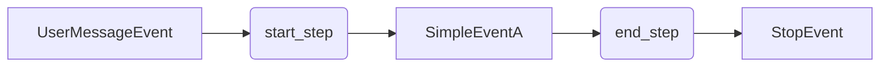
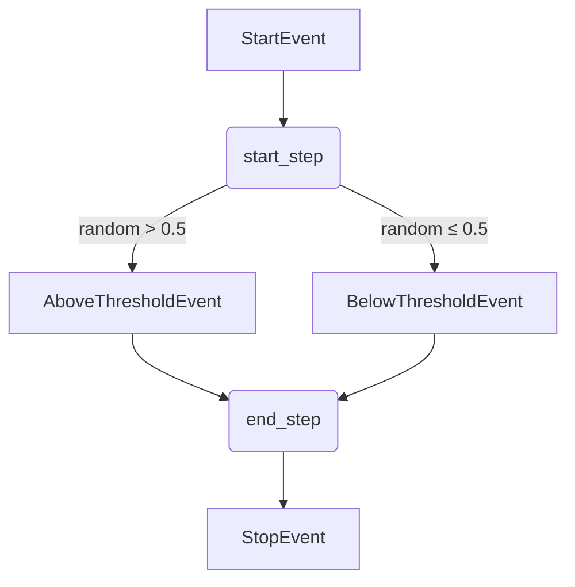
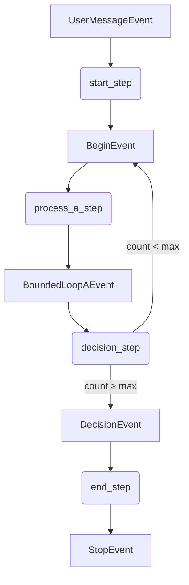
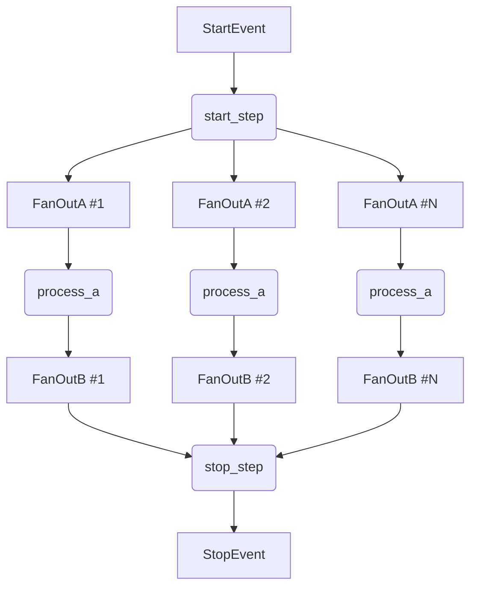
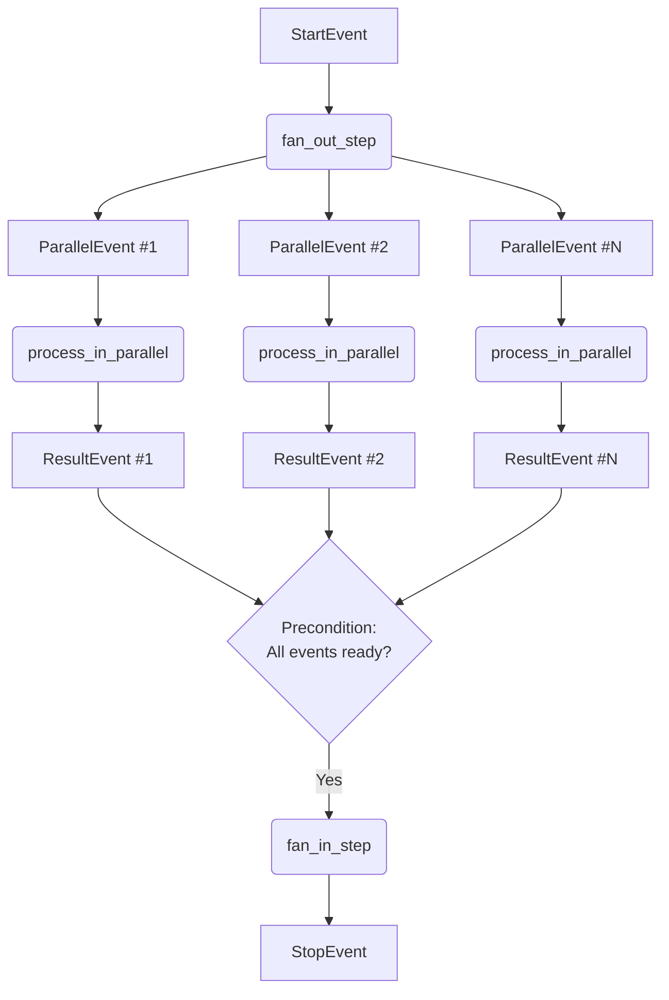
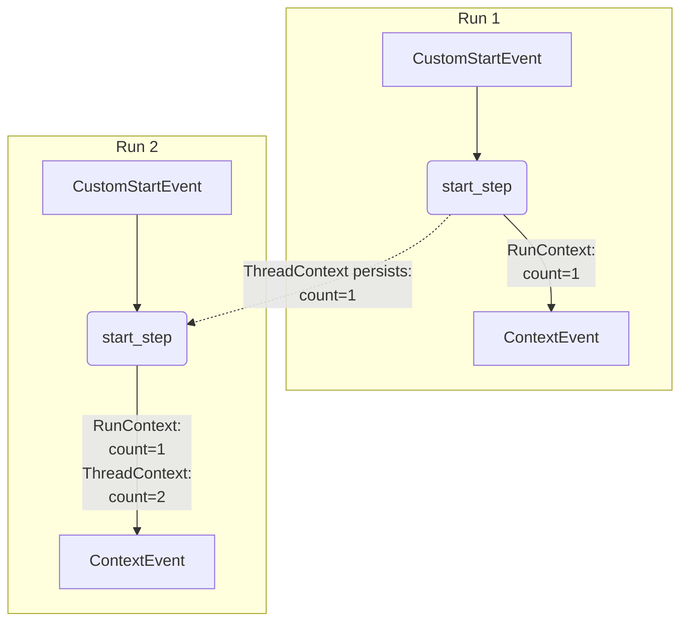
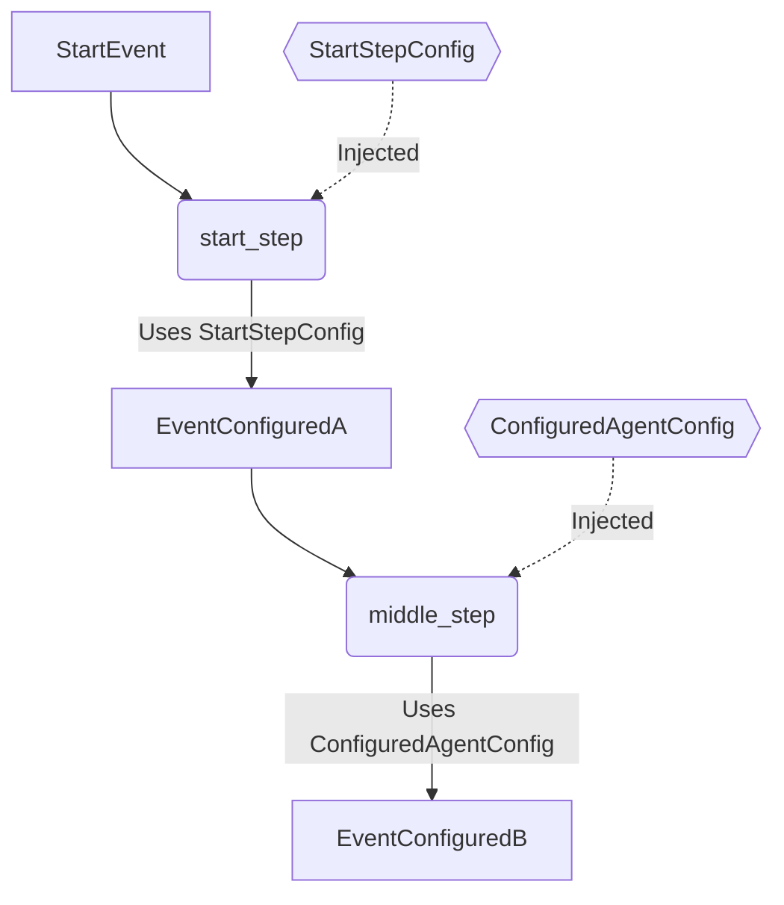
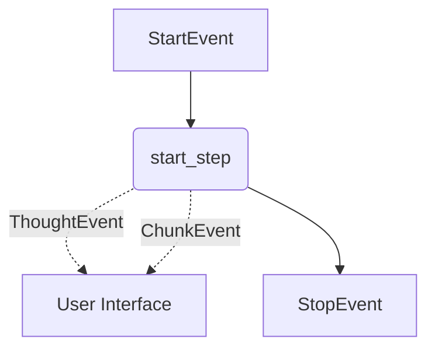
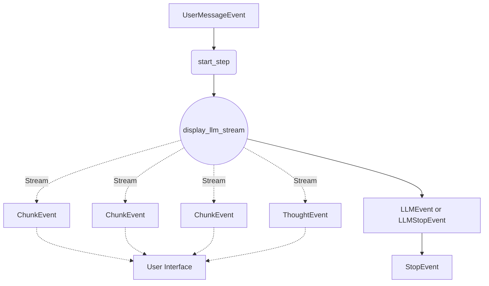
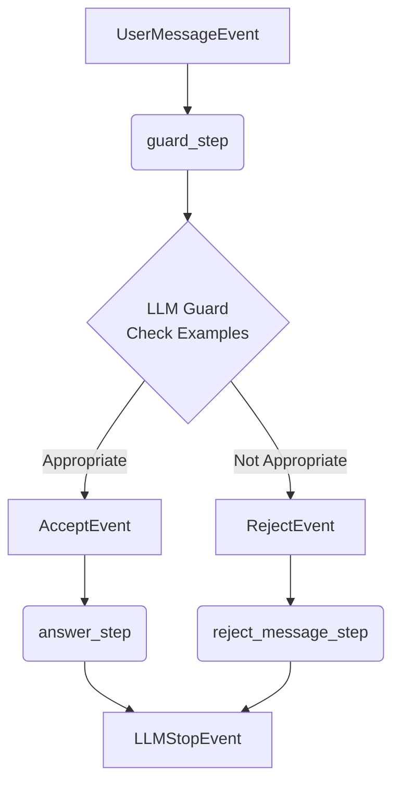

# Kern-Workflow-Muster

Diese Seite behandelt die grundlegenden, wiederverwendbaren Muster zum Aufbau von Agenten-Workflows. Durch die
Kombination dieser Bausteine können Sie anspruchsvolle und robuste Agenten erstellen. Jedes Muster enthält ein
prägnantes Codebeispiel und eine Erläuterung seines Zwecks.

Vollständige, lauffähige Beispiele finden Sie im Verzeichnis `playground/minimal_workflow/`.

## Workflow-Kontrollmuster

Diese Muster definieren den grundlegenden Ausführungsfluss in einem Agenten, von einfachen Sequenzen bis hin zu
komplexen Verzweigungen und paralleler Verarbeitung.

### Einfacher linearer Workflow

Ein **linearer Workflow** ist das grundlegendste Muster, bei dem Schritte in einer direkten Sequenz von einem Start- zu
einem Stopp-Ereignis ausgeführt werden.

- **Wann zu verwenden**: Ideal für einfache, sequentielle Aufgaben wie die Verarbeitung einer einzelnen Eingabe zur
  Erzeugung einer einzelnen Ausgabe.
- **Wie es funktioniert**: Ein Schritt gibt ein `ControlEvent` zurück, das vom nächsten Schritt konsumiert wird und eine
  direkte Kette bildet.



```python
class SimpleAgent(Agent):
    @step()
    async def start_step(self, event: UserMessageEvent) -> SimpleEventA:
        return SimpleEventA(payload=event.messages[-1].content)

    @step()
    async def end_step(self, event: SimpleEventA) -> StopEvent:
        return StopEvent()
```

### Bedingter Workflow (Verzweigung)

Ein **bedingter Workflow** erstellt Entscheidungspunkte, die es dem Agenten ermöglichen, basierend auf
Laufzeitbedingungen unterschiedliche Pfade zu verfolgen.

- **Wann zu verwenden**: Für Routing-Logik, die Behandlung verschiedener Benutzerabsichten oder die Klassifizierung von
  Daten.
- **Wie es funktioniert**: Die Rückgabetyp-Annotation eines Schritts enthält mehrere Ereignistypen (z.B.
  `EventA | EventB`). Der Dispatcher leitet den Workflow zu dem Schritt, der den spezifischen zurückgegebenen
  Ereignistyp behandelt.



```python
class ConditionalAgent(Agent):
    @step()
    async def start_step(self, event: StartEvent) -> AboveThresholdEvent | BelowThresholdEvent:
        if random.random() > 0.5:
            return AboveThresholdEvent()
        return BelowThresholdEvent()

    @step()
    async def end_step(self, event: AboveThresholdEvent | BelowThresholdEvent) -> StopEvent:
        # This step runs for either outcome of the start_step
        return StopEvent()
```

### Begrenzte Schleifen (Iteration)

Ein **schleifender Workflow** führt einen Schritt oder eine Reihe von Schritten mehrmals aus. Es ist entscheidend, dass
Schleifen eine klare Ausstiegsbedingung haben.

- **Wann zu verwenden**: Ideal für Wiederholungslogik, iterative Verfeinerung oder die Verarbeitung eines Stapels von
  Elementen.
- **Wie es funktioniert**: Ein Schritt gibt ein Ereignis zurück, das den Fluss zu einem früheren Schritt zurückleitet,
  wobei `RunContext` zur Zustandsverfolgung verwendet wird. Verwenden Sie den Parameter
  `@step(max_executions_per_run=N)` als Sicherheitsvorkehrung gegen Endlosschleifen.



```python
class BoundedLoopAgent(Agent):
    @step()
    async def start_step(self, event: UserMessageEvent, run_context: RunContext) -> BeginEvent:
        print("[SimpleAgent.start_step]")
        await run_context.set("loop_count", 0)
        return BeginEvent(count=0)

    @step()
    async def process_a_step(self, event: BeginEvent) -> BoundedLoopAEvent:
        print("[BoundedLoopAgent.process_a_step]")
        return BoundedLoopAEvent()

    @step()
    async def decision_step(
        self, event: BoundedLoopAEvent, agent_config: BoundedLoopAgentConfig, run_context: RunContext
    ) -> DecisionEvent | BeginEvent:
        loop_count = await run_context.get("loop_count")
        print("[BoundedLoopAgent.decision_step]", loop_count)
        if loop_count < agent_config.loop_max:
            await run_context.set("loop_count", loop_count + 1)
            return BeginEvent(count=loop_count + 1)

        return DecisionEvent()

    @step()
    async def end_step(self, event: DecisionEvent) -> StopEvent:
        print("[SimpleAgent.end_step]")
        return StopEvent()

```

### Fan-Out / Fan-In (Parallelverarbeitung)

Dieses leistungsstarke Muster ermöglicht es einem Agenten, eine Aufgabe in mehrere parallele Zweige aufzuteilen
(**Fan-Out**) und die Ergebnisse anschließend zu aggregieren (**Fan-In**).

- **Wann zu verwenden**: Für die Verarbeitung mehrerer Dokumente, das Durchführen paralleler API-Aufrufe oder jede
  Aufgabe, die in unabhängige Unteraufgaben zerlegt werden kann.
- **Wie es funktioniert**:
  - **Fan-Out**: Ein Schritt gibt eine `list` von Ereignissen zurück. Der Dispatcher löst dann den nächsten Schritt
    *einmal für jedes Ereignis in der Liste* aus, wodurch parallele Ausführungszweige entstehen.
  - **Fan-In**: Ein späterer Schritt verwendet eine **Precondition**, um zu warten, bis alle parallelen Zweige ihre
    Ergebnisereignisse produziert haben, bevor er ausgeführt wird.

#### Feste Anzahl von Ereignissen

Verwenden Sie `FixedList({event}, {number_of_events})`, um eine feste Anzahl erwarteter Ereignisse anzugeben:



```python
N = 5


class FanOutAgent(Agent):
    @step()
    async def start_step(self, _: StartEvent) -> list[FanOutA]:
        print("[start_step]")
        return [FanOutA(payload=str(i)) for i in range(N)]

    @step()
    async def process_a(self, event: FanOutA) -> FanOutB:
        return FanOutB(payload=event.payload)

    @step()
    async def stop_step(self, _: FixedList(FanOutB, N)) -> StopEvent:
        print("[stop_step]")
        return StopEvent()
```

#### Verwendung von Preconditions

Für dynamische Fan-In-Szenarien verwenden Sie eine Precondition-Funktion, um zu prüfen, ob alle Ergebnisse bereit sind:



```python
# The precondition function checks if all results are ready
@precondition()
async def ensure_enough_events(events: list[ParallelEvent], config: PreconditionAgentConfig) -> bool:
    return len(events) == config.number_of_events

class ParallelProcessingAgent(Agent):
    @step()
    async def fan_out_step(self, _: StartEvent, config: PreconditionAgentConfig) -> list[ParallelEvent]:
        # 1. Fan-Out: Return a list of events to start parallel branches
        return [ParallelEvent(payload=str(i)) for i in range(config.number_of_events)]

    @step()
    async def process_in_parallel(self, event: ParallelEvent) -> ResultEvent:
        # 2. This step runs in parallel for each ParallelEvent
        # ... process the event ...
        return ResultEvent(...)

    @step(precondition=ensure_enough_events)
    async def fan_in_step(self, _: list[ResultEvent]) -> StopEvent:
        # 3. Fan-In: This step only runs after the precondition is met
        # (i.e., all parallel branches have produced a ResultEvent)
        return StopEvent()
```

## Zustands- und Konfigurationsmuster

Diese Muster konzentrieren sich auf die dynamische Verwaltung des Speichers und Verhaltens eines Agenten.

### Kontextverwaltung (Der Speicher des Agenten)

Das SDK stellt injizierbare **Kontextobjekte** bereit, um Informationen während und zwischen Läufen zu speichern.

- **Wann zu verwenden**: Zum Verfolgen des Fortschritts, zum Speichern von Benutzereinstellungen oder zum Übergeben von
  Daten zwischen nicht-sequentiellen Schritten.
- **Wie es funktioniert**:
  - **`RunContext`**: Ephemerer Speicher für einen *einzelnen* Workflow-Lauf. Er wird bei einem `StartEvent` erstellt
    und bei einem `StopEvent` zerstört.
  - **`ThreadContext`**: Persistenter Speicher für einen Konversations-*Thread*. Er überdauert mehrere Agenten-Läufe.



```python
class ContextAgent(Agent):
    @step()
    async def start_step(self, event: CustomStartEvent, thread_context: ThreadContext, run_context: RunContext) -> ContextEvent:
        thread_count = await thread_context.get("count", 0) # Persists across runs
        run_count = await run_context.get("count", 0)     # Resets each run

        await thread_context.set("count", thread_count + 1)
        await run_context.set("count", run_count + 1)
        return ContextEvent(thread_count=thread_count + 1, run_count=run_count + 1)
```

### Konfigurationsgesteuertes Verhalten

Trennen Sie die Logik Ihres Agenten von seinen Einstellungen mithilfe der Klassen `AgentConfig` und `StepConfig`.

- **Wann zu verwenden**: Um wiederverwendbare Agenten zu erstellen, Einstellungen für verschiedene Umgebungen zu
  verwalten.
- **Wie es funktioniert**: Der Dispatcher injiziert die gesamte `AgentConfig` oder eine spezifische `StepConfig` in
  Ihren Schritt, basierend auf deren Typ-Annotation.



```python
class ConfiguredAgent(Agent):
    @step()
    async def start_step(self, event: StartEvent, config: StartStepConfig) -> EventConfiguredA:
        # Injects only the specific configuration for this step
        return EventConfiguredA(payload=config.some_step_value)

    @step()
    async def middle_step(self, event: EventConfiguredA, config: ConfiguredAgentConfig) -> EventConfiguredB:
        # Injects the entire agent's configuration
        return EventConfiguredB(payload=config.some_agent_value)
```

## Benutzerinteraktion und Feedback

Dieses Muster ist unerlässlich, um transparente und benutzerfreundliche Agenten zu erstellen.

### Anzeigen von Informationen

Agenten können dem Benutzer Echtzeit-Feedback geben, ohne die Logik des Workflows zu unterbrechen.

- **Wann zu verwenden**: Um die "Chain-of-Thought"-Begründung anzuzeigen, Status-Updates für langlaufende Aufgaben
  bereitzustellen oder Teilergebnisse zurückzustreamen.
- **Wie es funktioniert**: Injizieren Sie den `EventDisplayer` in einen Schritt. Verwenden Sie seine Methoden
  (`display_thought`, `display_chunk`), um `DisplayEvent`s an die Benutzeroberfläche zu senden. Diese Ereignisse
  beeinflussen den Kontrollfluss nicht.



```python
class DisplayingAgent(Agent):
    @step()
    async def start_step(self, event: StartEvent, displayer: EventDisplayer) -> StopEvent:
        await displayer.display_thought("Let me think....")
        await displayer.display_chunk("This is a partial result sent to the user.", model_name="gpt-4")
        # ... continue processing ...
        return StopEvent()
```

## LLM-Integrationsmuster

Diese Muster zeigen, wie Sie Large Language Models (LLMs) in Ihre Agenten-Workflows integrieren können, einschließlich
des Streamens von Antworten und der Kostenverfolgung.

### Streaming von LLM-Antworten an Benutzer

Streamen Sie LLM-Antworten inkrementell an Benutzer, während die Token-Nutzung und Kosten automatisch verfolgt werden.

- **Wann zu verwenden**: Für jeden Agenten, der LLM-generierte Antworten mit Echtzeit-Feedback bereitstellen muss.
- **Wie es funktioniert**: Die Methode `EventDisplayer.display_llm_stream()` streamt die LLM-Antwort als Chunks an die
  Benutzeroberfläche, während Puffer für Inhalt und Denkprozess gepflegt werden. Sie kann entweder `LLMEvent` oder
  `LLMStopEvent` (welches LLM-Daten mit StopEvent kombiniert) zurückgeben.



```python
# Example 1: Basic LLM streaming (returns LLMEvent)
class LlamaIndexAgent(Agent):
    @step()
    async def start_step(
        self,
        event: UserMessageEvent,
        agent_config: LlamaIndexAgentConfig,
        displayer: EventDisplayer,
    ) -> LLMEvent:
        async with agent_config.llm.cost_reporting_llm(displayer) as llm:
            return await displayer.display_llm_stream(
                agent_config.llm,
                llm,
                event.messages
            )

    @step()
    async def stop_step(self, event: LLMEvent) -> StopEvent:
        return StopEvent()

# Example 2: Direct to stop (returns LLMStopEvent)
class LLMWrappingAgent(Agent):
    @step()
    async def start_step(
        self,
        event: UserMessageEvent,
        agent_config: LLMWrappingAgentConfig,
        displayer: EventDisplayer,
    ) -> LLMStopEvent:
        async with agent_config.llm.cost_reporting_llm(displayer) as llm:
            # as_stop_step=True returns LLMStopEvent directly
            return await displayer.display_llm_stream(
                agent_config.llm,
                llm,
                event.messages,
                as_stop_step=True
            )
```

Der `cost_reporting_llm()` Context Manager umhüllt das LLM, um die Token-Nutzung automatisch zu verfolgen und
Kostenereignisse zu veröffentlichen, wenn der Kontext verlassen wird.

## Entscheidungsfindungs- und Routingmuster

Diese Muster ermöglichen es Agenten, intelligente Routing-Entscheidungen zu treffen, indem sie verschiedene
Ereignistypen aus einem Schritt basierend auf LLM-Analysen oder anderer Logik zurückgeben.

### Wie bedingtes Routing funktioniert

Ein Schritt kann basierend auf Laufzeitentscheidungen verschiedene Ereignistypen zurückgeben. Der Workflow-Dispatcher
leitet automatisch zum korrekten nächsten Schritt, basierend auf dem zurückgegebenen Ereignistyp.

**Kernkonzept**: Verwenden Sie Typ-Annotationen wie `EventA | EventB`, um mehrere mögliche Rückgabetypen zu deklarieren.
Der Dispatcher leitet automatisch zu Schritten, die jeden Ereignistyp behandeln.

### Beispiel: LLM Guard Check

**Anwendungsfall**: Überprüfen Sie anhand von beispielbasierter Klassifizierung, ob eine Benutzerfrage für den Agenten
geeignet ist, um sie zu beantworten.

**Von**: `RAGAgent.few_shot_guard_step` - validiert Fragen anhand von Few-Shot-Beispielen



```python
from swiss_ai_hub.core.events import UserMessageEvent
from swiss_ai_hub.core.displayers.event_displayer import EventDisplayer
from swiss_ai_hub.agent.agents.agent import Agent
from swiss_ai_hub.agent.workflow.decorators.step import step

# Define your guard events
class AcceptEvent(Event):
    reason: str

class RejectEvent(Event):
    reason: str

class SimpleGuardAgent(Agent):
    @step()
    async def guard_step(
        self,
        event: UserMessageEvent,
        agent_config: AgentConfig,
        displayer: EventDisplayer,
        t: LocaleHandler,
    ) -> AcceptEvent | RejectEvent:
        """
        Use LLM with examples to determine if question is appropriate.
        Returns different event types based on LLM decision.
        """
        user_query = event.messages[-1].content

        # Use LLM structured prediction to make decision
        async with agent_config.llm.cost_reporting_llm(displayer) as llm:
            guard_result = await few_shot_guard(
                llm=llm,
                t=t,
                user_query=user_query,
                examples=agent_config.few_shot_guard_examples,
            )

        # Branch based on LLM decision
        if guard_result.success:
            await displayer.display_thought(f"Question accepted: {guard_result.reasoning}")
            return AcceptEvent(reason=guard_result.reasoning)
        else:
            await displayer.display_thought(f"Question rejected: {guard_result.reasoning}")
            return RejectEvent(reason=guard_result.reasoning)

    @step()
    async def answer_step(
        self,
        event: UserMessageEvent,
        _: AcceptEvent,  # Only runs when question is accepted
        agent_config: AgentConfig,
        displayer: EventDisplayer,
    ) -> LLMStopEvent:
        """
        Generate answer - only runs for accepted questions.
        """
        async with agent_config.llm.cost_reporting_llm(displayer) as llm:
            return await displayer.display_llm_stream(
                agent_config.llm,
                llm,
                event.messages,
                as_stop_step=True
            )

    @step()
    async def reject_message_step(
        self,
        event: UserMessageEvent,
        reject_event: RejectEvent,  # Only runs when question is rejected
        agent_config: AgentConfig,
        displayer: EventDisplayer,
        t: LocaleHandler,
    ) -> LLMStopEvent:
        """
        Handle rejected questions - only runs for rejected questions.
        """
        # Add rejection message to conversation
        messages = event.messages + [
            ChatMessage(
                role=MessageRole.SYSTEM,
                content=t("agent.prompt.guard.reject", reason=reject_event.reason)
            )
        ]

        async with agent_config.llm.cost_reporting_llm(displayer) as llm:
            return await displayer.display_llm_stream(
                agent_config.llm,
                llm,
                messages,
                as_stop_step=True
            )
```
