# Agent memory

Agent memory enables long-term personalization and organizational knowledge sharing beyond single-session chat history.
The SDK provides two distinct memory scopes: user memory for private, per-user preferences and organization memory for
shared, tenant-wide facts.

Memory is automatically integrated into agent workflows through dependency injection and dedicated events.

## Two memory scopes

User memory is private to individual users and automatically extracted from conversation messages by the LLM. It stores
personal preferences, working styles, and individual context—things like "User prefers concise code examples in Python."
Both vector (semantic search) and graph (relationships) storage enable retrieval.

Organization memory is shared across all users in a tenant or namespace. Unlike user memory, it requires explicit
documentation rather than automatic inference. It stores company policies, project details, and team conventions—things
like "We deploy to production on Fridays." The same vector and graph storage supports semantic and relational retrieval.

## Memory workflow pattern

Both memory types follow a common four-step workflow:

```mermaid
graph LR
    A[UserMessageEvent] --> B(1. Retrieve Memory)
    B --> C[RetrieveMemoryEvent]
    C --> D(2. Extend Chat History)
    D --> E[AddMemoryToChatHistoryEvent]
    E --> F(3. Generate Response)
    F --> G[LLMEvent]
    G --> H(4. Store Memory)
    H --> I[StoreMemoryEvent]
    I --> J[StopEvent]
```



The pattern retrieves relevant memories, injects them into the chat history as a system message, generates a
memory-aware response, and persists new learnings.

## User memory pattern

User memory learns personal preferences automatically from conversations. The agent extracts facts about the user's
working style without requiring explicit documentation. Use this pattern for conversational agents that should adapt to
individual user preferences over time—code assistants, personal productivity agents, custom assistants.

Reference implementation: `playground/minimal_workflow/user_memory_workflow/`

::: warning The termination constraint
If memory persistence depends on LLM output, the LLM step **must not** return `StopEvent`. When `as_stop_step=True`, the
workflow terminates immediately with an `LLMStopEvent` — the memory storage step never executes.

```python
# INCORRECT: LLMStopEvent terminates before storage
@step()
async def respond(self, ..., displayer: EventDisplayer) -> LLMStopEvent:
    return await displayer.display_llm_stream(..., as_stop_step=True)  # Workflow ends here

@step()
async def store(self, llm: LLMStopEvent, ...) -> StoreMemoryEvent:
    ...  # Never executes — StopEvent already terminated the run

# CORRECT: LLMEvent allows downstream steps
@step()
async def respond(self, ..., displayer: EventDisplayer) -> LLMEvent:
    return await displayer.display_llm_stream(..., as_stop_step=False)

@step()
async def store(self, llm: LLMEvent, memory: AgentMemory) -> StoreUserMemoryEvent:
    await memory.add_user_memory(messages=llm.chat_messages, ...)
    return StoreUserMemoryEvent(...)

@step()
async def stop_step(self, _: StoreUserMemoryEvent) -> StopEvent:
    return StopEvent()
```

See [The dangling stop violation](../9_execution_model/#the-dangling-stop-violation) for the general rule.
:::

### Complete example

::: code-group
```python [UserMemoryAgent.py]
from swiss_ai_hub.agent.agents.agent import Agent
from swiss_ai_hub.agent.workflow.decorators.step import step
from swiss_ai_hub.core.generative_ai.memory.agent_memory import AgentMemory
from swiss_ai_hub.core.generative_ai.chat_history.extend_chat_history_with_user_memory import (
    extend_chat_history_with_user_memory,
)
from swiss_ai_hub.core.events.agent.user.user_message_event import UserMessageEvent
from swiss_ai_hub.core.events.agent.semantic.llm.llm_event import LLMEvent
from swiss_ai_hub.core.events.agent.control.stop.stop_event import StopEvent
from swiss_ai_hub.core.events.agent.memory.retrieve.retrieve_user_memory_event import RetrieveUserMemoryEvent
from swiss_ai_hub.core.events.agent.memory.history.add_user_memory_to_chat_history_event import AddUserMemoryToChatHistoryEvent
from swiss_ai_hub.core.events.agent.memory.store.store_user_memory_event import StoreUserMemoryEvent
from swiss_ai_hub.core.topics.agents.agent_instance_topic import AgentInstanceTopic
from swiss_ai_hub.core.displayers.event_displayer import EventDisplayer
from swiss_ai_hub.core.i18n.locale_handler import LocaleHandler

class UserMemoryAgent(Agent):
    """
    Memory-enhanced conversational agent that retrieves and persists user memories.

    Use this agent for personalized conversations requiring long-term context
    beyond single session chat history.
    """

    @step()
    async def retrieve_memory_step(
        self,
        event: UserMessageEvent,
        memory: AgentMemory,
    ) -> RetrieveUserMemoryEvent:
        """Searches user memories to provide personalized context."""
        memory_search_result = await memory.search_user_memory(
            query=event.user_query,
            user_id=event.user.id
        )
        return RetrieveUserMemoryEvent.from_memory_search_result(
            memory_search_result=memory_search_result
        )

    @step()
    async def add_memory_to_chat_history_step(
        self,
        user_message_event: UserMessageEvent,
        memory_event: RetrieveUserMemoryEvent,
        t: LocaleHandler
    ) -> AddUserMemoryToChatHistoryEvent:
        """Prepends memories as system message to guide LLM responses."""
        extended_chat_history = extend_chat_history_with_user_memory(
            chat_history=user_message_event.messages,
            memories=memory_event.memories,
            relations=memory_event.relations,
            user=user_message_event.user,
            t=t,
        )
        return AddUserMemoryToChatHistoryEvent(extended_history=extended_chat_history)

    @step()
    async def respond_with_memory_step(
        self,
        event: AddUserMemoryToChatHistoryEvent,
        agent_config: UserMemoryAgentConfig,
        displayer: EventDisplayer,
    ) -> LLMEvent:
        """Generates response using memory-enhanced chat history."""
        async with agent_config.llm.cost_reporting_llm(displayer) as llm:
            return await displayer.display_llm_stream(
                agent_config.llm,
                llm,
                event.extended_history,
                as_stop_step=False
            )

    @step()
    async def update_memory_step(
        self,
        user_message_event: UserMessageEvent,
        llm_event: LLMEvent,
        memory: AgentMemory,
        topic: AgentInstanceTopic,
    ) -> StoreUserMemoryEvent:
        """Persists conversation learnings to long-term memory."""
        memory_added = await memory.add_user_memory(
            messages=llm_event.chat_messages,
            user_id=user_message_event.user.id,
            thread_id=topic.thread_id,
            display_id=topic.display_id,
            run_id=topic.run_id,
        )
        return StoreUserMemoryEvent.from_memory_added_object(
            memory_added=memory_added
        )

    @step()
    async def stop_step(self, _: StoreUserMemoryEvent) -> StopEvent:
        """Marks workflow completion."""
        return StopEvent()
```

```python [UserMemoryAgentConfig.py]
from swiss_ai_hub.core.agents.agent_config import AgentConfig
from swiss_ai_hub.core.generative_ai.resources.models.llm.llm_config import LLMConfig

class UserMemoryAgentConfig(AgentConfig):
    llm: LLMConfig
```
:::

### Key components

#### AgentMemory injection

The `AgentMemory` object is automatically injected into steps via dependency injection:

```python
@step()
async def retrieve_memory_step(
    self,
    event: UserMessageEvent,
    memory: AgentMemory,  # Injected automatically
) -> RetrieveUserMemoryEvent:
    memory_search_result = await memory.search_user_memory(
        query=event.user_query,
        user_id=event.user.id
    )
    return RetrieveUserMemoryEvent.from_memory_search_result(
        memory_search_result=memory_search_result
    )
```

#### Memory retrieval

`search_user_memory()` performs semantic search against the user's private memory store. It takes the search query
(typically the user's current message), the user ID, and an optional limit (default: 100). It returns a
`MemorySearchResult` containing memories and relationships.

#### Chat history extension

The `extend_chat_history_with_user_memory()` helper inserts memories as a system message:

```python
extended_chat_history = extend_chat_history_with_user_memory(
    chat_history=user_message_event.messages,
    memories=memory_event.memories,
    relations=memory_event.relations,
    user=user_message_event.user,
    t=t,  # LocaleHandler for i18n
)
```

LLMs treat system messages as authoritative background information, so memories are presented as optional context that
the LLM may or may not use based on relevance. The memories are inserted after existing system messages (agent
personality/behavior) but before user messages.

#### Memory persistence

`add_user_memory()` uses an LLM to extract learnings from the conversation:

```python
memory_added = await memory.add_user_memory(
    messages=llm_event.chat_messages,  # Full conversation including LLM response
    user_id=user_message_event.user.id,
    thread_id=topic.thread_id,      # Swiss AI Agent Protocol context
    display_id=topic.display_id,    # Swiss AI Agent Protocol context
    run_id=topic.run_id,            # Swiss AI Agent Protocol context
)
```

The LLM analyzes the conversation and extracts facts like "User prefers Python over JavaScript" without storing the
entire conversation.

## Organization memory pattern

Organization memory stores explicit, shared organizational knowledge. Unlike user memory (which is inferred),
organization memory requires users to intentionally document facts. Use this pattern for agents managing shared
organizational context—team conventions, project documentation, company policies, or technical facts that all users
should know.

Reference implementation: `playground/minimal_workflow/organization_memory_workflow/`

### Complete example

::: code-group
```python [OrganizationMemoryAgent.py]
from swiss_ai_hub.agent.agents.agent import Agent
from swiss_ai_hub.agent.workflow.decorators.step import step
from swiss_ai_hub.core.generative_ai.memory.agent_memory import AgentMemory
from swiss_ai_hub.core.generative_ai.chat_history.extend_chat_history_with_organization_memory import (
    extend_chat_history_with_organization_memory,
)
from swiss_ai_hub.core.events.agent.user.user_message_event import UserMessageEvent
from swiss_ai_hub.core.events.agent.semantic.llm.llm_stop_event import LLMStopEvent
from swiss_ai_hub.core.events.agent.memory.store.store_organization_memory_event import StoreOrganizationMemoryEvent
from swiss_ai_hub.core.events.agent.memory.retrieve.retrieve_organization_memory_event import RetrieveOrganizationMemoryEvent
from swiss_ai_hub.core.events.agent.memory.history.add_organization_memory_to_chat_history_event import AddOrganizationMemoryToChatHistoryEvent
from swiss_ai_hub.core.topics.agents.agent_instance_topic import AgentInstanceTopic
from swiss_ai_hub.core.displayers.event_displayer import EventDisplayer
from swiss_ai_hub.core.i18n.locale_handler import LocaleHandler

class OrganizationMemoryAgent(Agent):
    """
    Organization memory management agent that stores and retrieves
    explicit organizational facts.

    Key Differences from UserMemoryAgent:
    - Input: Explicit facts (user provides clean memory text) vs. inferred from chat
    - Scope: Organization-wide (shared) vs. user-private
    - Namespace: Supports department-level scoping via tenant_namespace
    """

    @step()
    async def store_organization_memory_step(
        self,
        event: UserMessageEvent,
        memory: AgentMemory,
        topic: AgentInstanceTopic,
        agent_config: OrganizationMemoryAgentConfig,
    ) -> StoreOrganizationMemoryEvent:
        """Stores the user's query as an explicit organizational fact."""
        memory_added = await memory.add_organization_memory(
            memory=event.user_query,  # Direct storage - user query is the fact itself
            user_id=event.user.id,
            thread_id=topic.thread_id,
            display_id=topic.display_id,
            run_id=topic.run_id,
            tenant_id=agent_config.tenant_id,
            tenant_namespace=agent_config.tenant_namespace,
        )
        return StoreOrganizationMemoryEvent.from_memory_added_object(
            memory_added=memory_added
        )

    @step()
    async def retrieve_organization_memory_step(
        self,
        event: UserMessageEvent,
        memory: AgentMemory,
        agent_config: OrganizationMemoryAgentConfig,
    ) -> RetrieveOrganizationMemoryEvent:
        """Searches organization memories to provide shared org context."""
        memory_search_result = await memory.search_organization_memory(
            query=event.user_query,
            tenant_id=agent_config.tenant_id,
            tenant_namespace=agent_config.tenant_namespace,
            user_id=event.user.id,
        )
        return RetrieveOrganizationMemoryEvent.from_memory_search_result(
            memory_search_result=memory_search_result
        )

    @step()
    async def add_memory_to_chat_history_step(
        self,
        user_message_event: UserMessageEvent,
        memory_event: RetrieveOrganizationMemoryEvent,
        t: LocaleHandler
    ) -> AddOrganizationMemoryToChatHistoryEvent:
        """Prepends organization memories as system message."""
        extended_chat_history = extend_chat_history_with_organization_memory(
            chat_history=user_message_event.messages,
            memories=memory_event.memories,
            relations=memory_event.relations,
            t=t,
        )
        return AddOrganizationMemoryToChatHistoryEvent(extended_history=extended_chat_history)

    @step()
    async def respond_with_memory_step(
        self,
        event: AddOrganizationMemoryToChatHistoryEvent,
        agent_config: OrganizationMemoryAgentConfig,
        displayer: EventDisplayer,
    ) -> LLMStopEvent:
        """Generates response using memory-enhanced chat history."""
        async with agent_config.llm.cost_reporting_llm(displayer) as llm:
            return await displayer.display_llm_stream(
                agent_config.llm,
                llm,
                event.extended_history,
                as_stop_step=True
            )
```

```python [OrganizationMemoryAgentConfig.py]
from swiss_ai_hub.core.agents.agent_config import AgentConfig
from swiss_ai_hub.core.generative_ai.resources.models.llm.llm_config import LLMConfig

class OrganizationMemoryAgentConfig(AgentConfig):
    """Configuration for OrganizationMemoryAgent.

    Defines the LLM and the tenant context (ID and namespace) for memory scoping.
    """
    llm: LLMConfig
    tenant_id: str
    tenant_namespace: str
```
:::

### Key differences from user memory

#### Explicit storage (no inference)

Organization memory is stored directly as provided by the user:

```python
memory_added = await memory.add_organization_memory(
    memory=event.user_query,  # Direct - no LLM extraction
    # ... context fields ...
)
```

Organization memories affect all users, so explicit documentation ensures accuracy and intentionality. This prevents
accidental policy creation from casual conversation.

#### Tenant scoping

Organization memory supports multi-tenant and department-level isolation:

```python
memory_search_result = await memory.search_organization_memory(
    query=event.user_query,
    tenant_id=agent_config.tenant_id,           # Organization boundary
    tenant_namespace=agent_config.tenant_namespace,  # Department boundary
    user_id=event.user.id,
)
```

The namespace parameter scopes memories to departments. `"Engineering"` might contain technical documentation and
deployment procedures, `"Sales"` might contain product pricing and customer segments, and `None` indicates global tenant
knowledge.

#### Shared visibility

Retrieved memories are visible to all users in the tenant/namespace, not just the user who created them.

## Memory events

The memory system provides six specialized events for workflow control:

| Event type                                | Purpose                                         |
| ----------------------------------------- | ----------------------------------------------- |
| `RetrieveUserMemoryEvent`                 | Contains retrieved user memories                |
| `RetrieveOrganizationMemoryEvent`         | Contains retrieved organization memories        |
| `AddUserMemoryToChatHistoryEvent`         | Contains chat history with user memory injected |
| `AddOrganizationMemoryToChatHistoryEvent` | Contains chat history with org memory injected  |
| `StoreUserMemoryEvent`                    | Confirms user memory persistence                |
| `StoreOrganizationMemoryEvent`            | Confirms organization memory persistence        |

Memory retrieval and storage automatically emit display events for observability. These appear in the Swiss AI Agent
Protocol trace and require no special handling.

## Combining user and organization memory

For agents that need both memory types, combine the workflows:

```python
class HybridMemoryAgent(Agent):
    @step()
    async def retrieve_user_memory_step(
        self, event: UserMessageEvent, memory: AgentMemory
    ) -> RetrieveUserMemoryEvent:
        # Retrieve personal preferences
        result = await memory.search_user_memory(query=event.user_query, user_id=event.user.id)
        return RetrieveUserMemoryEvent.from_memory_search_result(result)

    @step()
    async def retrieve_org_memory_step(
        self, event: UserMessageEvent, memory: AgentMemory, config: AgentConfig
    ) -> RetrieveOrganizationMemoryEvent:
        # Retrieve organizational facts
        result = await memory.search_organization_memory(
            query=event.user_query,
            tenant_id=config.tenant_id,
            tenant_namespace=config.tenant_namespace,
            user_id=event.user.id
        )
        return RetrieveOrganizationMemoryEvent.from_memory_search_result(result)

    @step()
    async def combine_memories_step(
        self,
        event: UserMessageEvent,
        user_mem: RetrieveUserMemoryEvent,
        org_mem: RetrieveOrganizationMemoryEvent,
        t: LocaleHandler
    ) -> CombinedMemoryEvent:
        # Extend with both memory types
        chat_history = extend_chat_history_with_user_memory(
            chat_history=event.messages,
            memories=user_mem.memories,
            relations=user_mem.relations,
            user=event.user,
            t=t
        )
        chat_history = extend_chat_history_with_organization_memory(
            chat_history=chat_history,  # Already has user memory
            memories=org_mem.memories,
            relations=org_mem.relations,
            t=t
        )
        return CombinedMemoryEvent(extended_history=chat_history)
```

The order matters: user memories are added first (more general context), then organization memories (specific facts).

## Advanced usage

### Filtering memory retrieval

Narrow memory searches by agent or thread:

```python
@step()
async def retrieve_memory_step(
    self, event: UserMessageEvent, memory: AgentMemory, topic: AgentInstanceTopic
) -> RetrieveUserMemoryEvent:
    result = await memory.search_user_memory(
        query=event.user_query,
        user_id=event.user.id,
        agent_id=topic.agent_id,      # Only memories from this agent
        thread_id=topic.thread_id,    # Only memories from this conversation
    )
    return RetrieveUserMemoryEvent.from_memory_search_result(result)
```

Thread-specific filtering supports "recall what we discussed in this conversation" use cases. Agent-specific filtering
keeps a code assistant from seeing memories created by a RAG agent.

### Custom memory extraction

The `AgentMemory` class automatically customizes extraction based on agent class:

```python
class SpecializedMemoryAgent(Agent):
    @step()
    async def update_memory_step(
        self, user_message_event: UserMessageEvent, llm_event: LLMEvent, memory: AgentMemory, topic: AgentInstanceTopic
    ) -> StoreUserMemoryEvent:
        # AgentMemory automatically customizes extraction based on agent class
        memory_added = await memory.add_user_memory(
            messages=llm_event.chat_messages,
            user_id=user_message_event.user.id,
            thread_id=topic.thread_id,
            display_id=topic.display_id,
            run_id=topic.run_id,
        )
        # AgentMemory includes agent context automatically via self.agent_id
        return StoreUserMemoryEvent.from_memory_added_object(memory_added)
```

Code assistants extract technical preferences, RAG agents extract domain interests—all automatically based on agent
type.

### Config-driven memory

Production agents often make memory features optional via configuration flags. Use preconditions to gate memory steps
based on config, preventing race conditions with optional events:

```python
from swiss_ai_hub.agent.workflow.decorators.precondition import precondition

@precondition()
def check_memory_ready(
    user_event: UserMessageEvent,
    user_memory: RetrieveUserMemoryEvent | None,
    org_memory: RetrieveOrganizationMemoryEvent | None,
    config: AgentConfig,
) -> bool:
    if config.enable_user_memory and user_memory is None:
        return False
    if config.enable_org_memory and org_memory is None:
        return False
    return config.enable_user_memory or config.enable_org_memory

@precondition()
def check_storage_complete(
    llm: LLMEvent,
    stored: StoreUserMemoryEvent | None,
    config: AgentConfig,
) -> bool:
    if config.enable_memory_storage and stored is None:
        return False
    return True
```

The `check_memory_ready` precondition blocks the history extension step until all enabled memory types have been
retrieved. The `check_storage_complete` precondition blocks the final stop step until storage completes (if enabled).
This prevents the [optional parameter trap](../9_execution_model/#the-optional-parameter-trap) where steps execute
prematurely with `None` values.

## Observability

All memory operations are automatically traced in the observability dashboard. Retrieval traces show the query, returned
memories, and relevance scores. Storage traces show extracted memories, relationships, and metadata. Chat history
extension displays the system message with memory content.

All memories store full Swiss AI Agent Protocol context: `agent_id` (which agent created the memory), `thread_id` (which
conversation thread), `display_id` (UI display context), `run_id` (workflow execution ID), and `user_id` (who the memory
belongs to or who documented it). This enables complete auditability—you can trace back to which conversation taught the
agent a particular preference.

## Best practices

Use user memory for preferences ("User prefers brief responses") and organization memory for facts ("We deploy on
Fridays"). Let user memory infer from conversation while explicitly documenting organization memory. Always retrieve
memories at workflow start so memory context guides the entire response, and store new learnings at workflow end after
the LLM response is included.

Memory retrieval adds roughly 100ms latency. Use the `limit` parameter to avoid overwhelming context, and filter by
agent or thread when appropriate to reduce irrelevant memories.

User memory is GDPR-compliant—users can view, edit, and delete all their memories. Organization memory requires access
control since changes affect all users. Every memory tracks who created it and when for auditability, and all memory
data stays on Swiss infrastructure.

::: tip Next steps
Explore the complete examples in `playground/minimal_workflow/user_memory_workflow/` and
`playground/minimal_workflow/organization_memory_workflow/`. Review memory events in Langfuse after running a
memory-enhanced agent. Try building a hybrid agent combining both memory types, or experiment with namespace scoping for
department-level isolation.
:::
