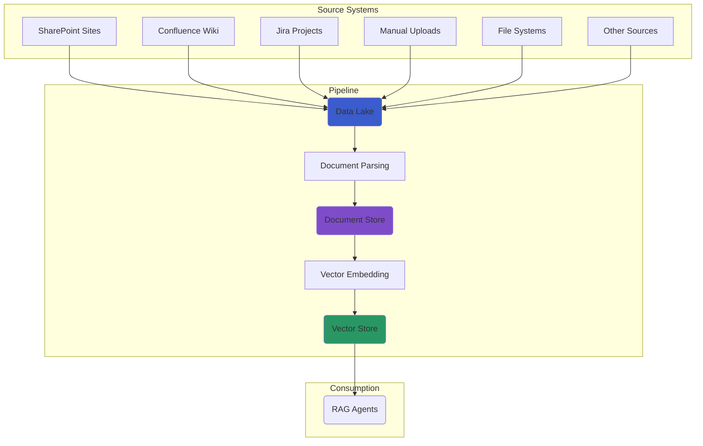

# Data Ingestion Pipeline

The Swiss AI Hub Pipeline SDK provides pre-built, production-ready pipeline definitions that you can use with minimal
configuration. These **factories** encapsulate best practices for ingesting documents and preparing them for RAG
applications.

## The Two-Stage Ingestion Architecture

Our ingestion process is split into two distinct stages, each handled by its own pipeline definition factory. This
promotes modularity and reusability.

1. **Stage 1: Source to Data Lake** (Optional): This pipeline connects to an external source (like SharePoint) and syncs
   its files to a central S3 data lake.
2. **Stage 2: Data Lake to Vector Store**: This pipeline monitors the S3 data lake, processes the documents, and stores
   the resulting embeddings in a vector store.



## 1. The Rclone Universal Source to Data Lake Pipeline

Use the `default_rclone_to_datalake_definitions` factory to sync documents from **any cloud storage provider** to your
S3 data lake. This is the recommended approach for most use cases as it supports 70+ storage backends with a single,
unified implementation.

- **What it does**: Observes any rclone-supported remote, downloads new or updated files, and cleans up files in the
  data lake that were deleted from the source.
- **Key Assets**: `observable_rclone`, `data_lake_files`, `removed_data_lake_files`.
- **Supported Sources**: SharePoint, OneDrive, Google Drive, AWS S3, Azure Blob, SFTP, local filesystem, and
  [70+ more](https://rclone.org/overview/).

### Quick Start with Templates

Swiss AI Hub provides pre-configured templates for common enterprise sources. Each template includes environment
variables, pipeline code, and setup instructions.

| Template         | Use Case                                | Environment Prefix    |
| ---------------- | --------------------------------------- | --------------------- |
| **SharePoint**   | Microsoft 365 document libraries        | `RCLONE_SHAREPOINT_*` |
| **OneDrive**     | Microsoft 365 personal/business storage | `RCLONE_ONEDRIVE_*`   |
| **Google Drive** | Google Workspace organizations          | `RCLONE_GDRIVE_*`     |
| **S3**           | AWS S3, MinIO, S3-compatible storage    | `RCLONE_S3_*`         |
| **Azure Blob**   | Azure Blob Storage                      | `RCLONE_AZUREBLOB_*`  |
| **SFTP**         | Legacy systems, secure file transfers   | `RCLONE_SFTP_*`       |
| **Local FS**     | Mounted network shares (NFS, SMB)       | Direct path           |

Templates are located in `aihub_pipeline/templates/sources/`.

### Usage Example: SharePoint

**1. Configure environment variables** (copy from `templates/sources/sharepoint/.env.template`):

```bash
RCLONE_SHAREPOINT_NAME=sharepoint
RCLONE_SHAREPOINT_TYPE=onedrive
RCLONE_SHAREPOINT_CLIENT_ID=your-client-id
RCLONE_SHAREPOINT_CLIENT_SECRET=your-secret
RCLONE_SHAREPOINT_TENANT=your-tenant-id
RCLONE_SHAREPOINT_SITE_URL=https://your-tenant.sharepoint.com/sites/your-site
RCLONE_SHAREPOINT_DRIVE_TYPE=documentLibrary
```

**2. Create your pipeline**:

```python
from aihub_lib.infrastructure.rclone.RcloneSourceFactory import sharepoint_source
from aihub_pipeline.util.definitions_util import default_rclone_to_datalake_definitions

# Load config from SHAREPOINT_* environment variables
sharepoint = sharepoint_source()

# Create pipeline
defs = default_rclone_to_datalake_definitions(
    datalake_container_name="my-company-docs",
    source_remote=f"{sharepoint.name}:",
    rclone_config=sharepoint,
    include_patterns=["*.pdf", "*.docx"],
    exclude_patterns=["**/archive/**"],
)
```

### Usage Example: Google Drive

```python
from aihub_lib.infrastructure.rclone.RcloneSourceFactory import google_drive_source
from aihub_pipeline.util.definitions_util import default_rclone_to_datalake_definitions

gdrive = google_drive_source()

defs = default_rclone_to_datalake_definitions(
    datalake_container_name="gdrive-docs",
    source_remote=f"{gdrive.name}:Shared Documents",
    rclone_config=gdrive,
)
```

### Usage Example: Local Filesystem / Mounted Shares

For local paths or mounted network shares (NFS, SMB, Azure Files), no rclone config is needed:

```python
from aihub_pipeline.util.definitions_util import default_rclone_to_datalake_definitions

defs = default_rclone_to_datalake_definitions(
    datalake_container_name="local-docs",
    source_remote="/mnt/shared-drive/documents",
)
```

### Available Source Helper Functions

The `RcloneSourceFactory` provides convenience functions that read from environment variables:

```python
from aihub_lib.infrastructure.rclone.RcloneSourceFactory import (
    sharepoint_source,    # Reads RCLONE_SHAREPOINT_* env vars
    onedrive_source,      # Reads RCLONE_ONEDRIVE_* env vars
    google_drive_source,  # Reads RCLONE_GDRIVE_* env vars
    s3_source,            # Reads RCLONE_S3_* env vars
    azure_blob_source,    # Reads RCLONE_AZUREBLOB_* env vars
    sftp_source,          # Reads RCLONE_SFTP_* env vars
    local_fs_source,      # Reads RCLONE_LOCAL_FS_* env vars
)
```

### Environment Variable Pattern

All source configurations follow a consistent pattern with the `RCLONE_` prefix:

```bash
RCLONE_<SOURCE>_NAME=remote-name       # Rclone remote name
RCLONE_<SOURCE>_TYPE=backend-type      # Rclone backend (onedrive, drive, s3, etc.)
RCLONE_<SOURCE>_CLIENT_ID=...          # OAuth client ID (if applicable)
RCLONE_<SOURCE>_CLIENT_SECRET=...      # OAuth client secret (if applicable)
RCLONE_<SOURCE>_TENANT=...             # Azure AD tenant (Microsoft sources)
RCLONE_<SOURCE>_<OPTION>=value         # Additional rclone options
```

Additional options are passed directly to rclone as backend-specific parameters:

```bash
RCLONE_S3_REGION=eu-west-1
RCLONE_S3_ENDPOINT=https://minio.example.com
RCLONE_SFTP_HOST=sftp.example.com
RCLONE_SFTP_PORT=22
```

### Rclone Service Authentication

In production environments, the rclone service requires authentication via `RCLONE_RC_USER` and `RCLONE_RC_PASS`
environment variables.

> **Security Warning**: The default credentials (`admin`/`changeme`) are intended for development only. **Always change
> these credentials in production deployments** to prevent unauthorized access to your data sources.

```bash
# Production environment - set strong, unique credentials
RCLONE_RC_USER=your-secure-username
RCLONE_RC_PASS=your-strong-password
```

## 2. The Data Lake to Vector Store Pipeline

This is the core RAG pipeline. Use the `default_definitions` factory to process documents from your S3 data lake into a
vector store.

- **What it does**: Observes an S3 bucket, parses documents, chunks them into nodes, optionally creates summary nodes,
  and stores the embeddings in Milvus. It also handles document deletions.
- **Key Assets**: `observable_data_lake`, `documents`, `nodes`, `summary_nodes`, `removed_documents`.

### Usage Example

```python
from aihub_pipeline.util.definitions_util import default_definitions

defs = default_definitions(
    datalake_container_name="my-company-docs",
    embedding_model_name="azure/text-embedding-3-large", # Configure the embedding model
    llm_model_name="azure/gpt-4o-mini",                 # Configure the LLM for summaries
    with_summary_nodes=True                             # Enable summary node generation
)
```

## Default Data Mapping

The SDK uses a consistent naming convention to map your data lake structure to the underlying storage backends (Document
Store and Vector Store).

### Container/Bucket → Database/Collection

The top-level S3 bucket name is used as the primary identifier for your storage resources, providing strong data
isolation.

**Example:**

- **Data Lake Bucket**: `s3://hr-documents/`
- **Document Store DB**: `hr-documents`
- **Vector Store Collection**: `hr-documents`

### Directory → Namespace

Within a bucket, you can use directories to create logical separations, which map to **namespaces** within the vector
store. This allows for multi-tenancy or logical grouping within a single collection.

**Example:**

- **Data Lake Path**: `s3://hr-documents/onboarding/`
- **Vector Store Namespace**: `onboarding`

## Running and Combining Pipelines

To run a pipeline, save your definitions code (e.g., `my_pipeline.py`) and use the Dagster CLI.

```bash
# Start the Dagster UI and development server
dagster dev -f my_pipeline.py
```
