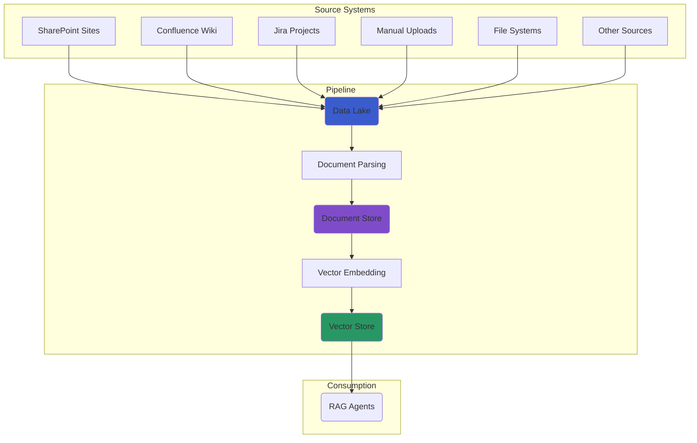

# Data Ingestion Pipeline

The Swiss AI Hub Pipeline SDK provides pre-built, production-ready pipeline definitions that you can use with minimal
configuration. These **factories** encapsulate best practices for ingesting documents and preparing them for RAG
applications.

## The Two-Stage Ingestion Architecture

Our ingestion process is split into two distinct stages, each handled by its own pipeline definition factory. This
promotes modularity and reusability.

1. **Stage 1: Source to Data Lake** (Optional): This pipeline connects to an external source (like SharePoint) and syncs
   its files to a central S3 data lake. It is configured per knowledge database from the UI.
2. **Stage 2: Data Lake to Vector Store**: This pipeline monitors the S3 data lake, processes the documents, and stores
   the resulting embeddings in a vector store.



## 1. The Rclone Source Pipeline (configured per knowledge database)

The rclone source pipeline pulls files from an external storage system into a knowledge database's data lake. It is
**configured per knowledge database from the UI**, not per deployment: one deployed `rclone_pipeline` code location
serves every database whose source is `rclone`, and nothing about a source lives in code or environment variables.

- **What it does**: Observes the remote of each database it fills, downloads new or updated files into that database's
  bucket, removes files from the data lake that were deleted from the source, and announces every change to the
  ingestion pipeline.
- **Key Assets**: `remote_files` (observable), `data_lake_files`, `removed_data_lake_files` in the
  `rclone_source_to_datalake` group.
- **Supported Backends**: OneDrive / SharePoint, Google Drive, AWS S3 (and S3-compatible), Azure Blob, SFTP, and a local
  path inside the rclone container.

### Two Axes of a Knowledge Database

A knowledge database carries two independent settings:

| Axis       | Field on the database              | Question it answers               | Set by                              |
| ---------- | ---------------------------------- | --------------------------------- | ----------------------------------- |
| `ingestor` | `ingestor` + `configuration`       | How are files processed (Stage 2) | Create dialog, fixed after creation |
| `source`   | `source` + `source_configuration`  | Where do files come from (Stage 1) | Create dialog, replaceable          |

A database without a source is filled by manual upload. The source configuration stays replaceable because credentials
rotate; a change takes effect on the pipeline's next run.

### Giving a Database a Source

1. In the create-database dialog, pick a **Source**. The selector offers every source pipeline that is currently
   deployed and has announced its form (`GET /knowledge/source-pipelines`).
2. Choose the **Storage backend** and fill in the backend's options; only the fields of the selected backend are shown.
3. Set the **Root folder** inside the source and, optionally, include/exclude patterns in
   [rclone filter syntax](https://rclone.org/filtering/) (for example `*.pdf`, `**/~$*`).
4. Save. The database is synced daily; the first observation creates a partition per file and the next one downloads
   them.

Replacing or clearing the source later goes through `PUT /knowledge/databases/{database}/source`. Clearing only stops
the sync; the files already in the data lake stay until the database is deleted.

### What a Database Stores

`source_configuration` holds the `backend_type`, `root_path`, `include_patterns`, `exclude_patterns`, and one option
group per backend:

| `backend_type` | Source                          | Options                                                                                   |
| -------------- | ------------------------------- | ----------------------------------------------------------------------------------------- |
| `onedrive`     | OneDrive, SharePoint            | `client_id`, `client_secret`, `tenant`, `drive_id`, `drive_type`, `region`, or a `token`  |
| `drive`        | Google Drive                    | `client_id`, `client_secret`, `token` or `service_account_credentials`, `root_folder_id`  |
| `s3`           | AWS S3, MinIO, S3-compatible    | `provider`, `access_key_id`, `secret_access_key`, `region`, `endpoint`                    |
| `azureblob`    | Azure Blob Storage              | `account`, `key` or `sas_url`, `endpoint`                                                 |
| `sftp`         | SFTP servers                    | `host`, `port`, `user`, `password` or `key_pem`                                           |
| `local`        | Path inside the rclone container | none                                                                                     |

A SharePoint document library is `onedrive` with `drive_type=documentLibrary`. OAuth backends accept a pre-obtained
rclone `token` JSON instead of client credentials; OneDrive without a token uses client credentials.

Credentials are secrets: the API encrypts them with the platform's `AIHUB_CONFIG_ENCRYPTION_KEY` before storing them,
returns them masked, and keeps the stored value when a form is resubmitted with the mask. The pipeline decrypts them per
run with the same key.

### Generated Namespaces

Files land at `s3://{database}/{top-level folder}/…`, and the ingestion pipeline maps the first path segment to a
namespace, as it does for uploads (see [Default Data Mapping](#default-data-mapping)). Namespaces of a sourced database
are therefore generated from the folders under the root path.

::: warning Root-level files are skipped
Files directly in the chosen root folder have no folder to become a namespace and are not synced. The observation
reports how many were skipped. Move them into a folder or point the root one level up.
:::

A sourced database has one owner of its content: it refuses manual upload, hand-made namespaces and manual document
deletion, because the next sync would re-create or remove them. The database can still be deleted as a whole.

### How a Synced File Reaches the Ingestion Pipeline

The source pipeline never writes to the document store or the vector store. After every written or removed file it
publishes a `SourceUpdatedEvent` on the owning ingestor's subject, the same event a browser upload triggers, so the
ingestion pipeline picks the change up within its sensor interval instead of at its next daily observation. The sync
itself runs on a daily schedule.

### Deployment

The platform ships the pipeline as the `rclone_pipeline` compose service (Dagster workspace entry `rclone_pipeline`),
next to the `rclone` daemon it drives over the RC API. Nothing per source is deployed; the service needs:

| Variable                                          | Purpose                                                          |
| ------------------------------------------------- | ---------------------------------------------------------------- |
| `AIHUB_CONFIG_ENCRYPTION_KEY`                     | Decrypts stored credentials; must equal the API's key            |
| `RCLONE_URL`, `RCLONE_RC_USER`, `RCLONE_RC_PASS`  | Reach and authenticate against the rclone daemon                 |
| `RCLONE_PIPELINE_OBSERVE_JOB_HOUR` / `_MINUTE`    | Time of the daily per-database sync                              |
| `RCLONE_PIPELINE_MAX_PARTITIONS`                  | Partitions added or removed per database per observation         |

The `rclone` container keeps no configuration file: the pipeline re-creates each database's remote from the stored
configuration on every run, so a credential change applies on the next run and a restarted daemon needs no operator
action. The container sits on the `backend` network (reached by the pipeline) and the `egress` network (reaches the
cloud providers); the pipeline itself talks to the daemon over `backend`.

::: warning Change the RC credentials in production
`RCLONE_RC_USER` / `RCLONE_RC_PASS` protect the daemon that holds every database's remote in memory. Set strong, unique
values in production deployments.
:::

### Extending the Source Pipeline

**Adding a backend** rclone supports but the form does not yet offer is a change in `packages/pipeline` and
`packages/core` only: one `Form` subclass with the backend's options (credentials as `Password` fields) and one field on
`RcloneSyncConfig` in `source_pipelines/rclone_sync_config.py`, the backend in `RcloneBackendType`, and labels in the
`lib/source_pipelines.*.yml` translations. The registration sensor re-announces the form; the API and the UI need no
change.

**A second source pipeline type** registers the way the rclone one does: a `SourcePipelineConfig` subclass declares its
form, and a `rclone_pipeline_definitions`-style factory with its own `source` token, display name and description wires
the registration sensor, the per-database schedule and the routed Stage-1 assets:

```python
from swiss_ai_hub.core.infrastructure import RclonePipelineSettings
from swiss_ai_hub.pipeline.util.rclone_pipeline_definitions_util import rclone_pipeline_definitions

defs = rclone_pipeline_definitions(settings=RclonePipelineSettings())   # the shipped app, source="rclone"
```

The `source` token must not collide with any ingestor token: both kinds of pipeline name their Dagster jobs after their
token, so the factory rejects a reserved id when the definitions are built. See ADR
`2026_09_09_source_pipelines_as_a_second_axis_of_a_knowledge_database`.

## 2. The Data Lake to Vector Store Pipeline

This is the core document ingestion pipeline. Use the `document_ingestion_pipeline_definitions` factory to process
documents from your S3 data lake into a vector store.

- **What it does**: Observes the S3 bucket of every knowledge database assigned to this ingestor, parses documents,
  chunks them into nodes, optionally creates summary nodes, and stores the embeddings in Milvus. It also handles
  document deletions, and the teardown of a whole database or folder.
- **Key Assets**: `observable_data_lake`, `documents`, `nodes`, `summary_nodes`, `removed_documents`.

### Usage Example

```python
from swiss_ai_hub.core.i18n import LocaleString
from swiss_ai_hub.core.infrastructure import DocumentIngestionPipelineSettings
from swiss_ai_hub.pipeline.util import document_ingestion_pipeline_definitions

defs = document_ingestion_pipeline_definitions(
    ingestor="my_rag",                                  # Databases assigned to this ingestor are served
    display_name=LocaleString(en="My RAG"),             # Shown in the create-database dialog
    description=LocaleString(en="Tuned for my documents"),
    settings=DocumentIngestionPipelineSettings()        # Deployment defaults, from DOCUMENT_INGESTION_*
)
```

`settings` carries the text, embedding and vision models, the three enrichment switches and the observation schedule.
Those are deployment defaults, not fixed behaviour. The pipeline announces a configuration form pre-filled with them,
each knowledge database created for this ingestor chooses its own values in the create dialog, and the pipeline reads
those values per run. See [Building Pipelines](../index.en.md#making-your-pipeline-selectable-in-the-ui) for how to add
a setting of your own.

## Default Data Mapping

The SDK uses a consistent naming convention to map your data lake structure to the underlying storage backends (Document
Store and Vector Store).

### Container/Bucket → Database/Collection

The top-level S3 bucket name is used as the primary identifier for your storage resources, providing strong data
isolation.

**Example:**

- **Data Lake Bucket**: `s3://hr-documents/`
- **Document Store DB**: `hr-documents`
- **Vector Store Collection**: `hr-documents`

### Directory → Namespace

Within a bucket, you can use directories to create logical separations, which map to **namespaces** within the vector
store. This allows for multi-tenancy or logical grouping within a single collection.

**Example:**

- **Data Lake Path**: `s3://hr-documents/onboarding/`
- **Vector Store Namespace**: `onboarding`

## Running and Combining Pipelines

To run a pipeline, save your definitions code (e.g., `my_pipeline.py`) and use the Dagster CLI.

```bash
# Start the Dagster UI and development server
dagster dev -f my_pipeline.py
```
