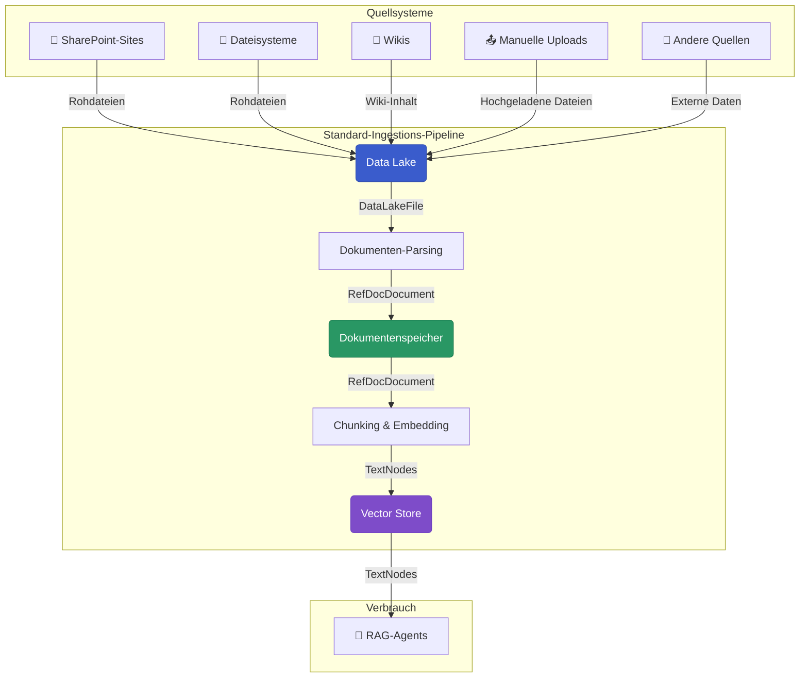

# Pipelines erstellen mit dem Swiss AI Hub SDK

Das Swiss AI Hub Pipeline SDK bietet ein leistungsstarkes, produktionsreifes Framework zum Erstellen von Dokumentenverarbeitungs-Pipelines. Es wurde entwickelt, um Dokumente aus verschiedenen Quellen aufzunehmen, zu parsen und durchsuchbare Vektor-Embeddings für Retrieval-Augmented Generation (RAG)-Systeme zu erstellen.

Dieser Leitfaden erklärt die Architektur des SDKs und zeigt Ihnen, wie Sie robuste, automatisierte Daten-Pipelines konfigurieren und deployen.

## Die Standard-Pipeline vom Data Lake zum Vector Store

Der Kern des SDKs ist eine vorgefertigte, konfigurierbare Pipeline, die den gesamten Weg von Rohdateien in einem Data Lake bis zu indizierten Embeddings in einem Vector Store abwickelt.



## Grundprinzipien

Unser SDK basiert auf einigen Grundprinzipien, um sicherzustellen, dass Pipelines effizient, skalierbar und wartbar sind:

- **Asset Factories**: Anstatt Boilerplate-Code zu schreiben, verwenden Sie einfache Factory-Funktionen, um ganze Sätze vorkonfigurierter Assets und Ressourcen zu generieren (z.B. `default_definitions`).
- **Änderungsgesteuerte Automatisierung**: Pipelines werden automatisch als Reaktion auf Datenänderungen ausgeführt, nicht nach festen Zeitplänen. Dies wird durch die Verwendung von **observablen Assets** erreicht, die Quellsysteme überwachen.
- **Dokumentenebene-Isolation**: Jedes Dokument wird in seiner eigenen **Partition** verarbeitet, was bedeutet, dass ein Fehler in einem Dokument nicht die gesamte Pipeline stoppt.
- **Pluggable I/O**: Benutzerdefinierte **I/O Manager** abstrahieren die Speicherlogik, was die Integration mit verschiedenen Datenbanken wie MongoDB und Milvus erleichtert, ohne Ihren Kernverarbeitungscode zu ändern.

## Schnellstart: Eine komplette Pipeline in unter 10 Zeilen

Die Factories des SDKs machen es unglaublich einfach, eine komplette Pipeline aufzubauen. Die Funktion `default_definitions` bündelt alle notwendigen Assets, Ressourcen, Jobs und Zeitpläne.

Erstellen Sie eine Datei namens `my_pipeline.py`:

```python
from swiss_ai_hub.pipeline.util.definitions_util import default_definitions

# This single function call creates a complete, production-ready pipeline
# that watches an S3 bucket and processes its contents into a local vector store.
defs = default_definitions(
    datalake_container_name="my-company-docs",
    embedding_model_name="local/qwen-embedding",
    llm_model_name="local/gemma-3-multimodal-small",
    with_summary_nodes=True
)
```

Um es auszuführen, zeigen Sie einfach mit der Dagster UI auf Ihre Datei: `dagster dev -f my_pipeline.py`

Dieser einzelne Funktionsaufruf bietet:

- Einen **observablen Data Lake**, der neue oder geänderte Dokumente automatisch erkennt.
- Einen mehrstufigen Verarbeitungs-Workflow einschließlich **Parsing**, **Chunking** und **Embedding**.
- Integration mit MongoDB für einen **Dokumentenspeicher** und Milvus für einen **Vector Store**.
- Vorkonfigurierte **Jobs**, **Zeitpläne** und **Sensoren** für produktionsreife Automatisierung.

## Nächste Schritte

1.  **[Grundlagen von Pipelines](./1_pipeline_fundamentals/)** - Verstehen Sie die architektonischen Entscheidungen und Muster für den Aufbau von Pipelines
2.  **[Kernmuster](./2_core_patterns/)** - Verstehen Sie die Kernmuster für den Aufbau von Pipelines mit Beispielen
3.  **[Daten-Ingestions-Pipeline](./3_data_ingestion_pipeline/)** - Konfigurieren und erweitern Sie die Standard-Pipeline
4.  **[Job-Planung](./4_job_scheduling/)** - Planen Sie Ihre Pipelines für automatische Ausführungen
5.  **[Pipeline-Beobachtung](./5_pipeline_observation/)** Überwachen Sie Ihre Pipelines auf Leistung und Fehler
