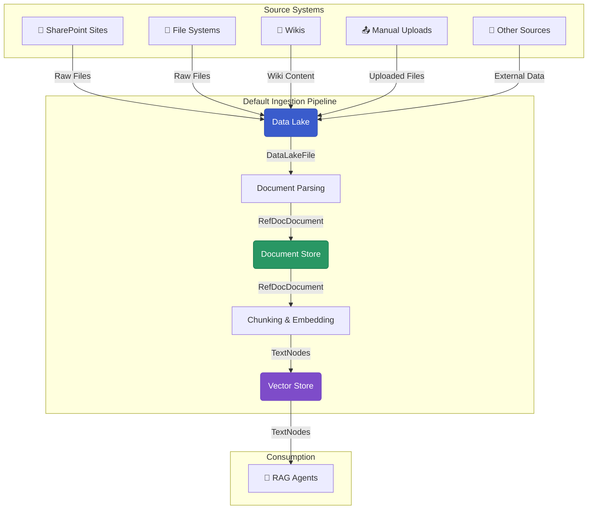

# Building Pipelines with the Swiss AI Hub SDK

The Swiss AI Hub Pipeline SDK provides a powerful, production-ready framework for building document processing
pipelines. It's designed to ingest documents from various sources, parse them, and create searchable vector embeddings
for Retrieval-Augmented Generation (RAG) systems.

This guide explains the SDK's architecture and shows you how to configure and deploy robust, automated data pipelines.

## The Default Data Lake to Vector Store Pipeline

The SDK's core is a pre-built, configurable pipeline that handles the entire journey from raw files in a data lake to
indexed embeddings in a vector store.



## Key Principles

Our SDK is built on a few key principles to ensure pipelines are efficient, scalable, and maintainable:

- **Asset Factories**: Instead of writing boilerplate, you use simple factory functions to generate entire sets of
  pre-configured assets and resources (e.g., `document_ingestion_pipeline_definitions`).
- **Change-Driven Automation**: Pipelines run automatically in response to data changes, not on fixed schedules. This is
  achieved using **observable assets** that monitor source systems.
- **Document-Level Isolation**: Each document is processed in its own **partition**, meaning a failure in one document
  won't halt the entire pipeline.
- **Pluggable I/O**: Custom **I/O Managers** abstract away storage logic, making it easy to integrate with different
  databases like MongoDB and Milvus without changing your core processing code.

## Quick Start: A Complete Pipeline in Under 10 Lines

The SDK's factories make it incredibly simple to stand up a complete pipeline. The
`document_ingestion_pipeline_definitions` function bundles all the necessary assets, resources, jobs, and schedules.

Create a file named `my_pipeline.py`:

```python
from swiss_ai_hub.core.i18n import LocaleString
from swiss_ai_hub.pipeline.util import document_ingestion_pipeline_definitions

# This single function call creates a complete, production-ready pipeline that serves every
# knowledge database assigned to this ingestor, resolving the target per run.
defs = document_ingestion_pipeline_definitions(
    ingestor="my_rag",
    display_name=LocaleString(en="My RAG"),
    description=LocaleString(en="Tuned for my documents"),
    embedding_model_name="local/qwen-embedding",
    llm_model_name="local/gemma-3-multimodal-small",
    with_summary_nodes=True
)
```

To run it, simply point the Dagster UI to your file: `dagster dev -f my_pipeline.py`

This single function call provides:

- An **observable data lake** per knowledge database, detecting new or changed documents.
- A multi-stage processing workflow including **parsing**, **chunking**, and **embedding**.
- Integration with MongoDB for a **document store** and Milvus for a **vector store**.
- Pre-configured **jobs**, **schedules**, and **sensors** for production-ready automation.
- Registration as a selectable ingestor, so users can create databases for it from the admin UI with no redeploy.

## Making your pipeline selectable in the UI

Passing `display_name` and `description` alongside your `ingestor` is what makes your pipeline appear in the
create-database dialog. There is nothing else to install and nothing to change in the platform.

Your pipeline advertises itself: a sensor it ships with publishes those labels to the platform database on a short
interval, and the API reads them from there. Registration goes through the database rather than an in-process registry
because the API and the pipelines run in **separate containers** — whether an ingestor exists is decided by what is
deployed, not by what happens to be importable inside the API image. Using a sensor rather than a module-level write
means a momentary database outage cannot stop your code location from loading; it simply registers on the next tick.

Three rules are worth knowing before you choose an id:

- **The labels are required.** A custom ingestor without `display_name` and `description` raises at definition time,
  because unlabelled it could only ever render as a bare id in the selector.
- **Some ids are reserved.** The platform's own routing tokens — including the frozen legacy ones, which stay reserved
  so nothing can adopt a legacy corpus — and `datalake`, which would collide in the event-subject grammar.
- **The id is permanent.** Asset keys, the partition registry, job names, the event stream and the storage prefix are
  all derived from it, so changing it later strands every database already assigned to the old value. Choose it once.

If your pipeline never appears in the dialog, check in order: the code location loaded, its registration sensor is
running in the Dagster UI, the row exists in the platform database, and the API can reach that same database.

Full details, including the exact call, are in the
[package README](https://github.com/bbvch-ai/aihub-core/tree/main/packages/pipeline#making-a-custom-pipeline-selectable-in-the-ui).

## Next Steps

1. **[Pipeline Fundamentals](./1_pipeline_fundamentals/)** - Understand the architectural decisions and patterns for
   building pipelines
2. **[Core Patterns](./2_core_patterns/)** - Understand the core patterns for building pipelines with examples
3. **[Data Ingestion Pipeline](./3_data_ingestion_pipeline/)** - Configure and extend the default pipeline
4. **[Job Scheduling](./4_job_scheduling/)** - Schedule your pipelines for automatic runs
5. **[Pipeline Observation](./5_pipeline_observation/)** Monitor your pipelines for performance and errors
