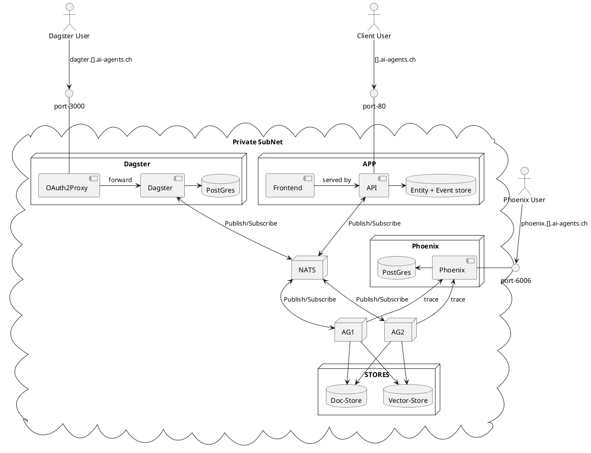

# Verteilungssicht

> **How to arc42:** 💡
>
>**Inhalt**
>
>Die Verteilungssicht beschreibt:
>
>1.  die technische Infrastruktur, auf der Ihr System ausgeführt wird,
>    mit Infrastrukturelementen wie Standorten, Umgebungen, Rechnern,
>    Prozessoren, Kanälen und Netztopologien sowie sonstigen
>    Bestandteilen, und
>
>2.  die Abbildung von (Software-)Bausteinen auf diese Infrastruktur.
>
>Häufig laufen Systeme in unterschiedlichen Umgebungen, beispielsweise
>Entwicklung-/Test- oder Produktionsumgebungen. In solchen Fällen sollten
>Sie alle relevanten Umgebungen aufzeigen.
>
>Nutzen Sie die Verteilungssicht insbesondere dann, wenn Ihre Software
>auf mehr als einem Rechner, Prozessor, Server oder Container abläuft
>oder Sie Ihre Hardware sogar selbst konstruieren.
>
>Aus Softwaresicht genügt es, auf die Aspekte zu achten, die für die
>Softwareverteilung relevant sind. Insbesondere bei der
>Hardwareentwicklung kann es notwendig sein, die Infrastruktur mit
>beliebigen Details zu beschreiben.
>
>**Motivation**
>
>Software läuft nicht ohne Infrastruktur. Diese zugrundeliegende
>Infrastruktur beeinflusst Ihr System und/oder querschnittliche
>Lösungskonzepte, daher müssen Sie diese Infrastruktur kennen.
>
>**Form**
>
>Das oberste Verteilungsdiagramm könnte bereits in Ihrem technischen
>Kontext enthalten sein, mit Ihrer Infrastruktur als EINE Blackbox. Jetzt
>zoomen Sie in diese Infrastruktur mit weiteren Verteilungsdiagrammen
>hinein:
>
>-   Die UML stellt mit Verteilungsdiagrammen (Deployment diagrams) eine
>    Diagrammart zur Verfügung, um diese Sicht auszudrücken. Nutzen Sie
>    diese, evtl. auch geschachtelt, wenn Ihre Verteilungsstruktur es
>    verlangt.
>
>-   Falls Ihre Infrastruktur-Stakeholder andere Diagrammarten
>    bevorzugen, die beispielsweise Prozessoren und Kanäle zeigen, sind
>    diese hier ebenfalls einsetzbar.
>
>Siehe [Verteilungssicht](https://docs.arc42.org/section-7/) in der
>online-Dokumentation (auf Englisch!).
>
>## Infrastruktur Ebene 1
>
>An dieser Stelle beschreiben Sie (als Kombination von Diagrammen mit
>Tabellen oder Texten):
>
>-   die Verteilung des Gesamtsystems auf mehrere Standorte, Umgebungen,
>    Rechner, Prozessoren o. Ä., sowie die physischen Verbindungskanäle
>    zwischen diesen,
>
>-   wichtige Begründungen für diese Verteilungsstruktur,
>
>-   Qualitäts- und/oder Leistungsmerkmale dieser Infrastruktur,
>
>-   Zuordnung von Softwareartefakten zu Bestandteilen der Infrastruktur
>
>Für mehrere Umgebungen oder alternative Deployments kopieren Sie diesen
>Teil von arc42 für alle wichtigen Umgebungen/Varianten.
>
>***&lt;Übersichtsdiagramm>***
>
>Begründung  
>*&lt;Erläuternder Text>*
>
>Qualitäts- und/oder Leistungsmerkmale  
>*&lt;Erläuternder Text>*
>
>Zuordnung von Bausteinen zu Infrastruktur  
>*&lt;Beschreibung der Zuordnung>*
>
>## Infrastruktur Ebene 2
>
>An dieser Stelle können Sie den inneren Aufbau (einiger)
>Infrastrukturelemente aus Ebene 1 beschreiben.
>
>Für jedes Infrastrukturelement kopieren Sie die Struktur aus Ebene 1.
>
>### *&lt;Infrastrukturelement 1>*
>
>*&lt;Diagramm + Erläuterungen>*
>
>### *&lt;Infrastrukturelement 2>*
>
>*&lt;Diagramm + Erläuterungen>*
>
>…
>
>### *&lt;Infrastrukturelement n>*
>
>*&lt;Diagramm + Erläuterungen>*

 
