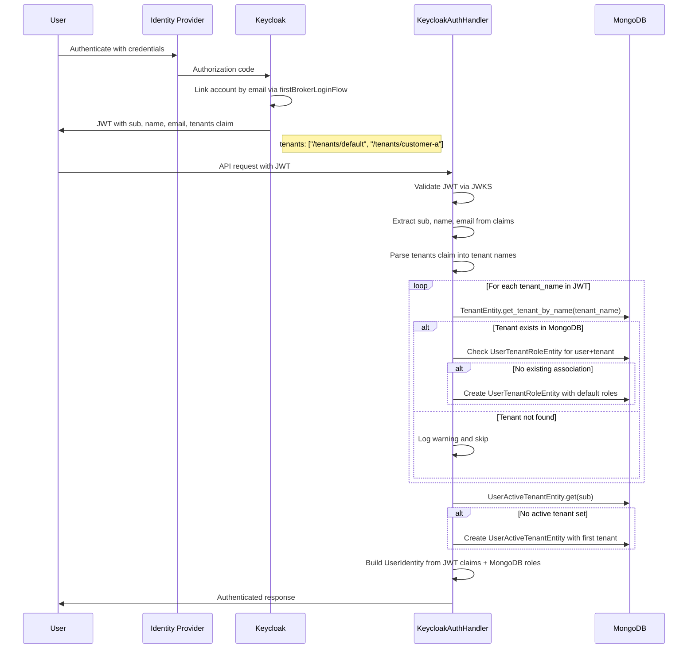
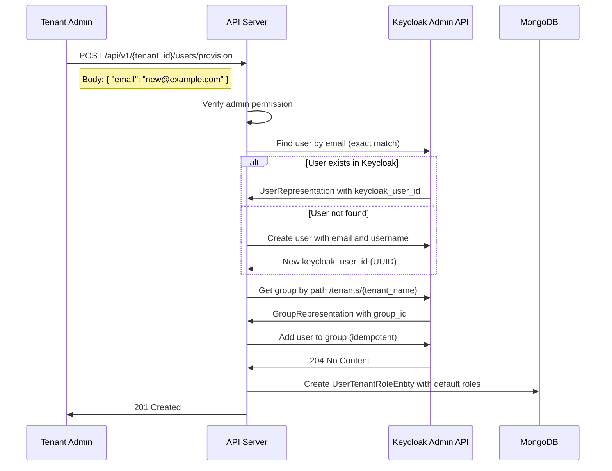
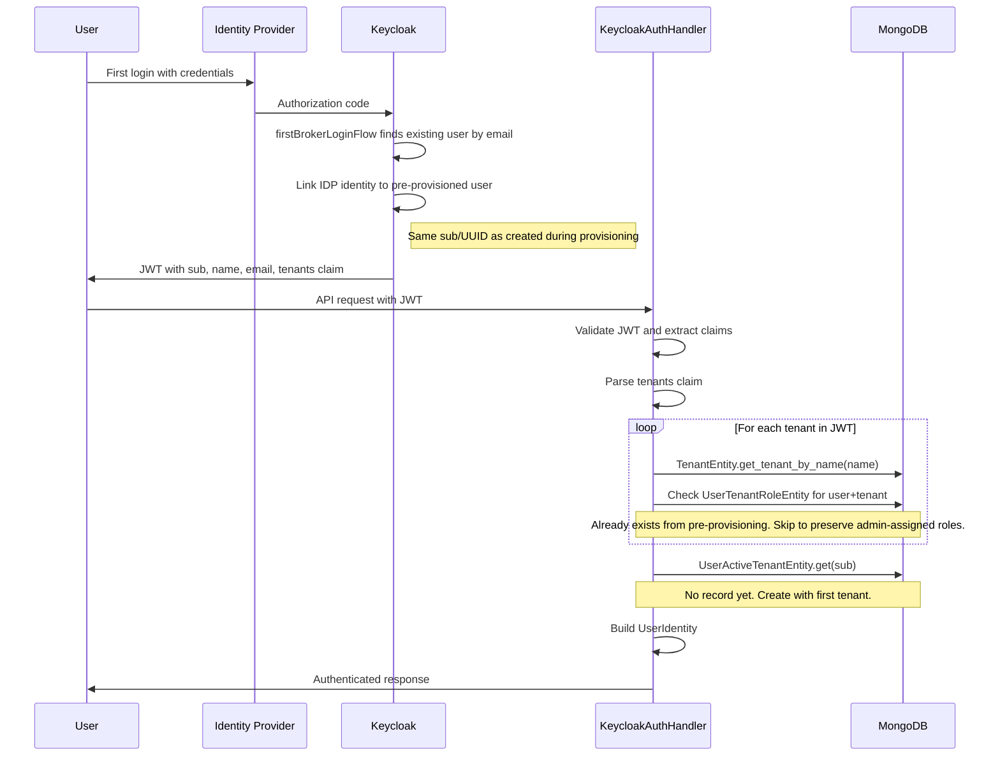
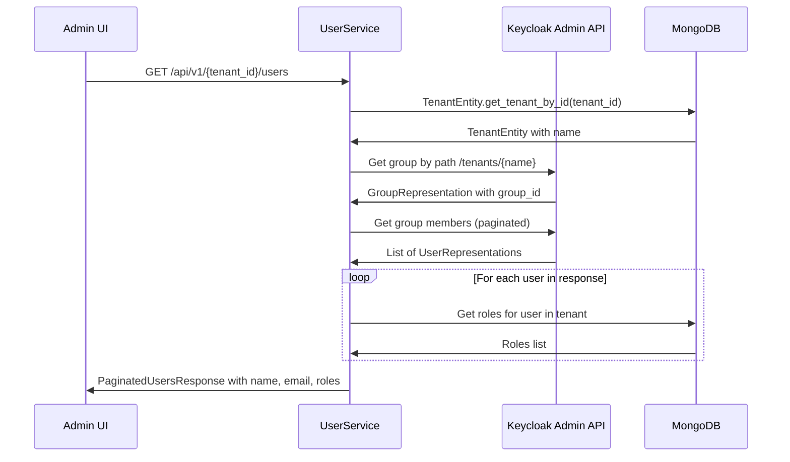
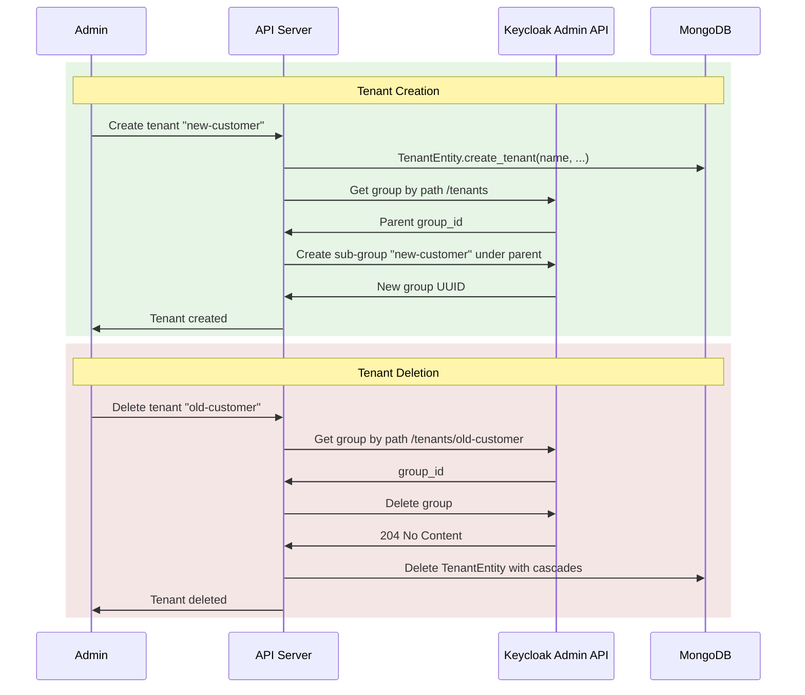

# User Management Concept: Keycloak as Source of Truth

## Overview

This document describes the target architecture for user management in Swiss AI Hub, where Keycloak becomes the
authoritative source for user identity and tenant membership. MongoDB retains only application-specific user preferences
(dashboard, favorites, active tenant) in dedicated collections, each keyed by the Keycloak user ID (`sub`). The
monolithic `UserEntity` collection is eliminated.

## Current State

Today, user management is split across Keycloak and MongoDB with unclear ownership:

- **Keycloak** stores user credentials, IDP federation, and group memberships (`/tenants/*` groups). A `tenants` claim
  is configured in the JWT via a Group Membership protocol mapper — but the application does not read it.
- **MongoDB `UserEntity`** stores id, name, email, profile_image, active_tenant_id, dashboard, and favorite_modules.
  Created via JIT provisioning on first login (`ensure_user_exists_for_auth()`).
- **MongoDB `UserTenantRoleEntity`** stores user-to-tenant associations with roles. This is the current source of truth
  for "which user belongs to which tenant."

The result is duplicated data (name/email in both Keycloak and MongoDB), unclear ownership (tenant membership in both
Keycloak groups and MongoDB), and no ability to pre-provision users before their first login.

## Target State

### Ownership Split

| Data                         | Owner        | Storage                            |
| ---------------------------- | ------------ | ---------------------------------- |
| User existence (name, email) | **Keycloak** | Keycloak user records              |
| Tenant membership            | **Keycloak** | Keycloak groups under `/tenants/*` |
| Roles within a tenant        | **MongoDB**  | `UserTenantRoleEntity` (unchanged) |
| Role definitions             | **MongoDB**  | `RoleEntity` (unchanged)           |
| Tenant metadata              | **MongoDB**  | `TenantEntity` (unchanged)         |
| Active tenant                | **MongoDB**  | New `UserActiveTenantEntity`       |
| Dashboard                    | **MongoDB**  | New `UserDashboardEntity`          |
| Favorite modules             | **MongoDB**  | New `UserFavoritesEntity`          |

### What Changes

1. **`UserEntity` is removed.** It is replaced by three purpose-specific collections and Keycloak Admin API queries.
2. **The `tenants` JWT claim is consumed.** `KeycloakAuthHandler` reads tenant memberships from the token and syncs them
   to `UserTenantRoleEntity`.
3. **User profile data (name, email, profile_image) is read from Keycloak Admin API** wherever it is needed for users
   other than the logged-in user. The logged-in user's profile is already in the JWT claims.
4. **Pre-provisioning is supported.** Tenant admins can add users by email before they log in.

### What Stays the Same

- **`UserTenantRoleEntity`** — roles within a tenant remain locally managed per ADR `2025_12_25`.
- **`RoleEntity`** — role definitions with hierarchical wildcard access rules stay in MongoDB.
- **`TenantEntity`** — tenant metadata, access rules, and configuration stay in MongoDB.
- **Active tenant stays in MongoDB** — per ADR `2026_02_20`: "Keycloak does NOT manage active tenants." Active tenant is
  a session-level concept that must switch instantly without a token refresh.

## New MongoDB Collections

The monolithic `UserEntity` is replaced by three independent collections, each keyed by the Keycloak `sub` (user ID).
Records are created lazily — only when the user first interacts with the feature.

### `UserActiveTenantEntity`

Tracks which tenant a user is currently working in. Read on every authenticated request (when path param is `"active"`).

```python
class UserActiveTenantEntity(Document):
    meta = {"collection": "user_active_tenants"}
    id = StringField(primary_key=True)          # Keycloak sub
    active_tenant_id = StringField(required=True)
    last_updated = DateTimeField(required=True)
```

### `UserDashboardEntity`

Stores the user's GridStack dashboard configuration. Read/written only by the my-account endpoints.

```python
class UserDashboardEntity(Document):
    meta = {"collection": "user_dashboards"}
    id = StringField(primary_key=True)          # Keycloak sub
    dashboard = EmbeddedDocumentField(Dashboard)
```

### `UserFavoritesEntity`

Stores the user's favorite module IDs. Read/written only by the my-account endpoints.

```python
class UserFavoritesEntity(Document):
    meta = {"collection": "user_favorites"}
    id = StringField(primary_key=True)          # Keycloak sub
    favorite_modules = ListField(StringField(), default=list)
```

## Keycloak Admin API Operations

All operations use the `python-keycloak` library (>=7.1.1, already installed). The `KeycloakAdmin` class provides async
methods prefixed with `a_`. All endpoints are verified against Keycloak 26.5.4.

### Service Account

The existing `aihub-api-service` service account needs additional `realm-management` client roles:

| Role           | Purpose                                 |
| -------------- | --------------------------------------- |
| `manage-users` | Create users, add/remove from groups    |
| `view-users`   | Read user details and group memberships |
| `query-users`  | Search users by email                   |
| `query-groups` | List and search groups                  |
| `view-groups`  | Read group details and members          |

Current (in realm JSON): `"realm-management": ["view-identity-providers"]` Target:
`"realm-management": ["view-identity-providers", "manage-users", "view-users", "query-users", "query-groups", "view-groups"]`

### Operation Catalog

| Operation              | python-keycloak Method                                                               | Returns                     |
| ---------------------- | ------------------------------------------------------------------------------------ | --------------------------- |
| Find user by email     | `a_get_users(query={"email": email, "exact": True})`                                 | `list[UserRepresentation]`  |
| Create user            | `a_create_user({"email": email, "username": email, "enabled": True}, exist_ok=True)` | `str` (user UUID)           |
| Find group by path     | `a_get_group_by_path("/tenants/{tenant_name}")`                                      | `GroupRepresentation`       |
| Add user to group      | `a_group_user_add(user_id, group_id)`                                                | `dict` (empty, HTTP 204)    |
| Remove user from group | `a_group_user_remove(user_id, group_id)`                                             | `dict` (empty, HTTP 204)    |
| List group members     | `a_get_group_members(group_id, query={"first": offset, "max": limit})`               | `list[UserRepresentation]`  |
| Get group children     | `a_get_group_children(parent_group_id)`                                              | `list[GroupRepresentation]` |
| Create sub-group       | `a_create_group({"name": tenant_name}, parent=tenants_parent_id, skip_exists=True)`  | `str \| None` (group UUID)  |
| Delete group           | `a_delete_group(group_id)`                                                           | `dict` (empty, HTTP 204)    |

Notes:

- `a_get_group_by_path("/tenants/customer-a")` is the most efficient tenant group lookup — single HTTP call.
- `a_group_user_add` is idempotent — calling it when user is already in the group returns 204.
- `a_create_user` with `exist_ok=True` returns the existing user's UUID instead of raising on conflict.
- `exact` must be Python `True` (bool), not the string `"true"`.

### KeycloakAdminService

A thin async wrapper around `KeycloakAdmin` that encapsulates the operations above. Lives in
`packages/core/swiss_ai_hub/core/auth/` since it depends on `KeycloakSettings` and is used by multiple packages.

```python
class KeycloakAdminService:
    """Wraps Keycloak Admin API for user and group management."""

    @staticmethod
    async def find_user_by_email(email: str) -> dict | None: ...
    @staticmethod
    async def create_user(email: str) -> str: ...
    @staticmethod
    async def get_tenant_group(tenant_name: str) -> dict: ...
    @staticmethod
    async def assign_user_to_tenant(keycloak_user_id: str, tenant_name: str) -> None: ...
    @staticmethod
    async def remove_user_from_tenant(keycloak_user_id: str, tenant_name: str) -> None: ...
    @staticmethod
    async def get_tenant_members(tenant_name: str, offset: int, limit: int) -> list[dict]: ...
    @staticmethod
    async def get_user_by_id(keycloak_user_id: str) -> dict: ...
    @staticmethod
    async def get_users_by_ids(keycloak_user_ids: list[str]) -> dict[str, dict]: ...
```

## Flows

### Flow 1: User Login (Keycloak Auth)

The login flow changes to consume the `tenants` JWT claim and sync tenant memberships. No `UserEntity` is created — only
`UserTenantRoleEntity` records are synced if missing.



### Flow 2: Pre-Provisioning a User

A tenant admin adds a user by email before they have ever logged in. The user is created in Keycloak and assigned to the
tenant group. When they eventually log in, the login flow (Flow 1) picks up the membership from the JWT.



### Flow 3: First Login of a Pre-Provisioned User

When a pre-provisioned user logs in for the first time via their IDP, Keycloak links the IDP identity to the existing
Keycloak user (by email). The JWT includes tenant memberships from the pre-provisioning step.



### Flow 4: Admin User List

The admin user list now queries Keycloak for profile data (name, email, profile_image) instead of MongoDB. Tenant
membership is determined by Keycloak group membership.



### Flow 5: Tenant Lifecycle Sync

When a tenant is created or deleted in the application, the corresponding Keycloak group is also created or deleted.



## Migration from UserEntity

### Consumers to Migrate

Every place that currently reads from `UserEntity` must be updated:

| Current Usage                              | File                                                                                                       | Migration                                                                        |
| ------------------------------------------ | ---------------------------------------------------------------------------------------------------------- | -------------------------------------------------------------------------------- |
| `UserEntity.ensure_user_exists_for_auth()` | `keycloak_auth_handler.py`, `open_webui_auth_handler.py`, `dangerous_development_only_auth_handler.py`     | Replace with tenants-claim sync + `UserActiveTenantEntity` creation              |
| `UserEntity.by_oid()` for profile          | `user_service.py`, `my_account_service.py`                                                                 | Query Keycloak Admin API for profile; query new entities for dashboard/favorites |
| `UserEntity.by_email()`                    | `openai_completion_handler.py`, `agent_completion_handler.py`, `open_webui_auth_handler.py`                | `KeycloakAdminService.find_user_by_email()`                                      |
| `UserEntity.get_by_ids()` for names        | `thread_service.py`, `process_service.py`                                                                  | `KeycloakAdminService.get_users_by_ids()`                                        |
| `UserEntity.get_paginated_users()`         | `user_service.py`                                                                                          | `KeycloakAdminService.get_tenant_members()` via group membership                 |
| `UserEntity.count_users()`                 | `user_service.py`                                                                                          | Keycloak group member count                                                      |
| `UserEntity.active_tenant_id` reads        | `auth_handler.py` (`_resolve_active_tenant`)                                                               | `UserActiveTenantEntity.get(sub)`                                                |
| `UserEntity.active_tenant_id` writes       | `user_entity.py` (`set_active_tenant`), cascade clears in `tenant_entity.py`, `user_tenant_role_entity.py` | `UserActiveTenantEntity` updates                                                 |
| `UserEntity.dashboard`                     | `my_account_service.py`                                                                                    | `UserDashboardEntity`                                                            |
| `UserEntity.favorite_modules`              | (used via DTOs)                                                                                            | `UserFavoritesEntity`                                                            |
| `MinimalUserDTO.from_user_entity()`        | `human_work_response_dto.py`, `program_work_response_dto.py`, `process_service.py`                         | `MinimalUserDTO.from_keycloak_user(user_representation)`                         |

### Migration Script

A one-time migration is needed for existing deployments:

1. Read all `UserEntity` records from MongoDB
2. For each user, verify they exist in Keycloak (`a_get_users(email=..., exact=True)`)
3. For each `UserTenantRoleEntity`, ensure the user is in the corresponding Keycloak group
4. Migrate dashboard data to `UserDashboardEntity`
5. Migrate favorites data to `UserFavoritesEntity`
6. Migrate active_tenant_id to `UserActiveTenantEntity`
7. After verification, drop the `users` collection

## Implementation Phases

### Phase 0: Foundation

- Upgrade service account permissions in realm JSON template
- Create `KeycloakAdminService` wrapper in `packages/core`
- Create new MongoDB entities (`UserActiveTenantEntity`, `UserDashboardEntity`, `UserFavoritesEntity`)
- Files: `keycloak-realm.json.j2`, new entity files, new service file

### Phase 1: Consume `tenants` Claim

- Parse `tenants` claim in `KeycloakAuthHandler.authenticate_token()`
- Map `/tenants/{name}` paths to `TenantEntity` by name
- Additive sync: ensure `UserTenantRoleEntity` exists for each JWT tenant
- Replace `ensure_user_exists_for_auth()` with the new login flow
- Files: `keycloak_auth_handler.py`, `user_entity.py`, auth handler tests

### Phase 2: Replace UserEntity Reads with Keycloak Queries

- Migrate all `UserEntity.by_oid()` / `by_email()` / `get_by_ids()` calls to `KeycloakAdminService`
- Migrate dashboard/favorites/active-tenant reads to new entities
- Update `MinimalUserDTO` and `UserDTO` to construct from Keycloak `UserRepresentation`
- Update bot handlers to use `KeycloakAdminService.find_user_by_email()`
- Files: `user_service.py`, `my_account_service.py`, `thread_service.py`, `process_service.py`, bot handlers, DTOs

### Phase 3: Pre-Provisioning API

- Add `POST /api/v1/{tenant_id}/users/provision` endpoint
- Implement provisioning flow: create in Keycloak + assign to group + create `UserTenantRoleEntity`
- Permission: `aihub.admin.service.users`
- Files: `user_controller.py`, `user_service.py`, new DTOs

### Phase 4: Tenant Lifecycle Sync
[ctc_vm_access.pub](../../../.ssh/ctc_vm_access.pub)
- When creating a `TenantEntity`, also create a Keycloak group under `/tenants/`
- When deleting a `TenantEntity`, also delete the Keycloak group
- When removing a user from a tenant, also remove from the Keycloak group
- Files: tenant service layer, `user_tenant_role_entity.py`

### Phase 5: Remove UserEntity

- Write and run migration script
- Drop `UserEntity` and the `users` collection
- Remove all imports and references
- Files: migration script, cleanup across all packages

## Risks and Mitigations

| Risk                                             | Impact                                          | Mitigation                                                                          |
| ------------------------------------------------ | ----------------------------------------------- | ----------------------------------------------------------------------------------- |
| Service account credentials exposure             | Full user management access                     | Kubernetes secrets; rotate regularly                                                |
| Keycloak Admin API unavailable                   | Pre-provisioning and user listing fail          | Authentication still works (JWKS cached 6h); admin operations return clear errors   |
| Group name / tenant name mismatch                | Users lose tenant access                        | Validate on tenant creation; consider `keycloak_group_name` field on `TenantEntity` |
| Existing users without Keycloak groups           | Users appear to have no tenants after migration | One-time migration script (Phase 5)                                                 |
| First-login race: JWT processed before role sync | User has tenant membership but no roles         | Additive sync in login flow creates `UserTenantRoleEntity` with default roles       |
| Bot handlers depend on email lookup              | Bot auth breaks if Keycloak is down             | Bot handlers already require Keycloak for JWT validation; same dependency           |

## Related ADRs

- `2026_02_20_keycloak_tenant_assignment_via_groups.md` — Tenant assignments as Keycloak groups (governs this concept)
- `2025_12_25_local_role_management.md` — Roles managed locally in MongoDB (unchanged by this concept)
- `2025_12_28_keycloak_as_identity_broker.md` — Keycloak as sole OIDC provider (extended by this concept)
